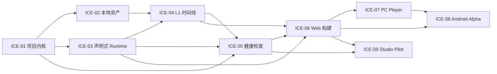

# CineFlow Engine 任务总索引

> 状态：Planning Only / 未派工
>
> 上游：[引擎里程碑版本计划](../../releases/interactive-cinematic-engine-milestone-plan.md)
>
> 控制面：本索引不改变 `docs/orchestration/status.json`、当前派工看板、文件锁或现有 P0 任务。任何实现任务仍须建立正式 task/session card、取得文件锁并满足当前发布门禁。

## 1. 任务总览

| ID     | 任务卡                                              | 目标里程碑 | 前置                          | 当前状态               |
| ------ | --------------------------------------------------- | ---------- | ----------------------------- | ---------------------- |
| ICE-01 | [项目内核与可靠保存](ice-01-project-kernel.md)      | E2         | E1 与 P0-2 显式派工           | planned_not_dispatched |
| ICE-02 | [本地资产与许可](ice-02-local-assets.md)            | E3         | ICE-01                        | planned_not_dispatched |
| ICE-03 | [声明式互动 Runtime](ice-03-declarative-runtime.md) | E4         | ICE-01                        | planned_not_dispatched |
| ICE-04 | [L1 媒体时间线](ice-04-l1-media-timeline.md)        | E4         | ICE-02、ICE-03                | planned_not_dispatched |
| ICE-05 | [项目健康检查](ice-05-project-health.md)            | E4         | ICE-01、ICE-03、ICE-04        | planned_not_dispatched |
| ICE-06 | [Web Runtime 构建](ice-06-web-build.md)             | E5         | ICE-03、ICE-04、ICE-05        | planned_not_dispatched |
| ICE-07 | [PC Player](ice-07-pc-player.md)                    | E6         | ICE-06                        | planned_not_dispatched |
| ICE-08 | [Android Player Alpha](ice-08-android-player.md)    | E7         | ICE-06、ICE-07                | planned_not_dispatched |
| ICE-09 | [设计合作与付费试点](ice-09-studio-pilot.md)        | E8         | ICE-05、ICE-06 与所售目标平台 | planned_not_dispatched |

## 2. 关键路径



## 3. 共同派工规则

1. 一次只激活一张依赖链上的实现卡；并行只能发生在文件范围和验收证据互不重叠时。
2. 每张卡在派工前必须补齐：负责人、会话、允许文件、禁止文件、开始条件、验收者和证据目录。
3. 实现、测试、安装包验证、外部用户验证、商业接受与 Git 状态必须独立记录。
4. 不得用 UI、远程示例、mock、模拟日志、旧包或作者现场接管替代对应验收。
5. 任意出现数据损失、路径越界、任意脚本执行、假成功或未授权媒体问题时，停止后续里程碑推进。

## 4. 回调格式

```text
task_id:
status: planned | active | blocked | implemented | tested | verified | accepted
scope_completed:
evidence:
tests:
residual_risks:
files_touched:
commit:
next_gate:
```
