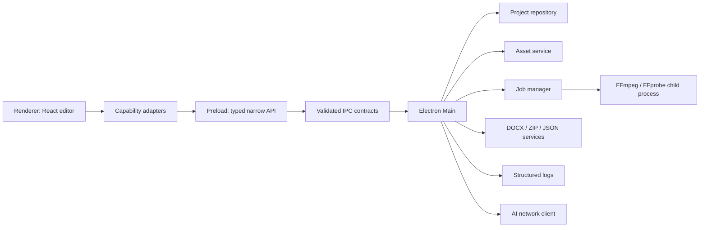

# CinePlayStudio PC Desktop Porting Technical Plan

> - 文档状态：Execution Baseline Draft 2
> - 目标平台：Windows 10/11 x64
> - 技术路线：React 19 + Vite 6 + Electron + TypeScript
> - 本轮重点：性能、数据可靠性、代码质量、工程规范、可验证交付

## 1. 执行结论

当前工程是 React + Vite + Express 组成的互动影游编辑器原型。现有 UI、剧情节点流、时间轴、播放器、项目管理、AI 剧本拆分和导出界面可以复用，但本地项目、资产处理、媒体导出和部分“原生能力”仍是浏览器存储、远程示例或模拟结果。

PC 版采用 Electron，不重写 Vue，不在 MVP 阶段追求完整非线性编辑器和云分发。迁移的本质不是“给网页套壳”，而是建立以下可长期维护的桌面工程基础：

1. 用户可控、可迁移、不会因崩溃轻易损坏的项目文件。
2. Renderer、Preload、Main、外部二进制之间明确且可审计的边界。
3. 对大文件和长任务使用流式、异步、可取消的处理模型。
4. 单一项目模型、类型化 IPC、稳定错误码和结构化日志。
5. 能在 Windows CI 和打包产物上重复验证的质量门禁。

### 1.1 PC MVP 定义

“可分发 PC MVP”必须同时满足：

- Windows 桌面窗口可启动，现有编辑器 UI 与核心交互可用。
- 项目保存在用户选择的项目目录，重启、异常退出后可恢复。
- 可导入本地视频、音频、图片和文档，资产真实复制到项目目录。
- 可预览本地视频，并可导出 JSON、DOCX、ZIP 到用户选择的位置。
- Renderer 无 Node 权限，不执行外部项目携带的任意 JavaScript。
- 关键操作有结构化日志，安装包可安装、启动和卸载。
- 安装包内的 FFprobe 可探测包含中文和空格路径的视频。
- 性能预算和自动化质量门禁达到第 12、14、17 节要求。

MVP 不包含真实多轨视频渲染、OSS、自动更新和任意 JavaScript 插件。这些能力不能以 mock 成功状态计入 MVP。

### 1.2 非目标

- 不从 React 改写为 Vue/Element Plus。
- 不把当前时间轴扩展为 Premiere、DaVinci 级非编系统。
- 不在 MVP 中支持任意脚本插件、远程项目协作、云端同步。
- 不在业务组件内同时维护 Electron、Express、localStorage 三套分支。
- 不把示例 URL、模拟日志、模拟上传进度视为真实桌面能力。

## 2. 当前工程事实

| 领域            | 当前事实                                   | PC 迁移结论                        |
| --------------- | ------------------------------------------ | ---------------------------------- |
| UI              | React 19、Vite 6、Tailwind CSS 4           | 保留                               |
| 节点流          | `@xyflow/react`                            | 保留，增加性能基线                 |
| 时间轴          | 自研多轨时间轴                             | 保留，后续按数据量做虚拟化         |
| 项目存储        | `localStorage`，多个 key，缺统一 schema    | 必须重构                           |
| 资产导入        | 读取文件信息后替换为远程示例 URL           | 必须重构                           |
| 条件和动作      | Renderer 中使用 `new Function`             | MVP 必须移除                       |
| 插件编辑        | 以 `new Function` 做语法检查               | MVP 只保存静态描述，不执行代码     |
| AI              | Express 调用 Gemini 或自定义 endpoint      | 通过能力适配器保留 Web/PC 两种实现 |
| FFprobe         | 尝试调用系统 FFprobe，失败后返回 mock      | 打包静态二进制并移除“假成功”       |
| FFmpeg pipeline | 返回模拟日志和示例下载 URL                 | 不计入 MVP，后续实现真实任务       |
| DOCX            | Express 真实生成文档                       | 迁到 Main service，复用生成逻辑    |
| ZIP             | 只生成配置、脚本和模拟日志，不包含真实资产 | 重写                               |
| 工程验证        | `lint` 实际是 `tsc --noEmit`               | 拆分 typecheck、lint、test、build  |
| 发行            | 无 Electron、安装器、签名、更新和本地日志  | 分阶段建立                         |

成熟度不再用主观百分比表示。每项能力只允许使用四种状态：

- `mock`：只有 UI 或模拟返回。
- `dev_verified`：开发环境真实运行通过。
- `packaged_verified`：安装包或 unpacked 产物真实运行通过。
- `release_verified`：自动化门禁、人工验收和发行约束全部通过。

## 3. 架构决策

### D1：保留 React，使用 Electron 作为 Windows 桌面层

现有产品价值集中在 React UI 和编辑交互，框架重写不会提升桌面能力。Electron 负责操作系统集成、项目文件、资产、媒体进程、日志和安装包。

### D2：项目目录归用户所有，`userData` 不保存大型项目资产

项目创建时必须让用户选择位置，或使用可配置的默认项目根目录。项目目录建议使用：

```text
<user-selected>/<project-name>.CinePlayStudio/
  project.json
  assets/
    originals/
    proxies/
  thumbnails/
  exports/
  .cache/
  .recovery/
```

Electron `app.getPath('userData')` 只保存应用级数据：

```text
%APPDATA%/CinePlayStudio/
  config.json
  recent-projects.json
  logs/
  crash-dumps/
  migrations/
```

原因：视频项目可能达到数 GB，不能默认进入 roaming AppData。项目目录必须可以被用户复制、备份和迁移。

### D3：Renderer 永远按不可信进程处理

- Renderer 不直接访问 `fs`、`path`、`child_process`、`process.env`。
- Preload 只暴露窄接口，不暴露通用 `ipcRenderer`。
- Main 对所有参数重新校验，不能信任 Preload 已经校验。
- 项目文件、拖入文件、自定义 endpoint、URL 和 IPC payload 都是不可信输入。

### D4：只保留一个规范项目模型

内部保存、导入备份、ZIP manifest 和迁移逻辑必须围绕同一个 `ProjectDocument`。发布包可以有独立 `PublishedProjectManifest`，但必须由规范模型显式转换，不能在组件和服务中各自拼装 JSON。

### D5：大文件和长任务统一采用 Job 模型

资产复制、缩略图生成、媒体探测、ZIP、DOCX 和 FFmpeg 都通过任务服务执行：

- 每个任务有 `jobId`、状态、进度、开始/结束时间和稳定错误码。
- 支持取消的任务必须提供 `cancel(jobId)`。
- 进度事件需要节流，Renderer 卸载时必须退订。
- Main 不读取整个视频或 ZIP 到内存，优先流式 I/O。
- FFmpeg 使用独立子进程，不能在 Renderer 或同步 IPC 中执行。

### D6：Web/PC 双形态只在适配器层分叉

React 组件只依赖以下能力接口，不直接判断 `window.cinePlayStudio`，不直接拼 `/api/*`：

```ts
interface AppCapabilities {
  projects: ProjectRepository;
  assets: AssetRepository;
  media: MediaGateway;
  exports: ExportGateway;
  ai: AiGateway;
  diagnostics: DiagnosticsGateway;
}
```

- Electron 实现通过 Preload/IPC。
- Web 实现通过 localStorage、fetch 和 Blob download。
- Web 不支持的能力返回结构化 `UNSUPPORTED_CAPABILITY`，不能假装成功。

## 4. 目标架构



### 4.1 Renderer

- 管理短生命周期 UI 状态、选区、播放控制和编辑命令。
- 项目业务状态通过明确的 store/service 管理，不继续集中膨胀在 `App.tsx`。
- 大型列表、节点和时间轴只渲染可见范围。
- 不保存绝对路径，不执行任意代码，不持有长期 API key。

### 4.2 Preload

- 使用 `contextBridge.exposeInMainWorld` 暴露 `window.cinePlayStudio`。
- 使用共享 schema 校验输入输出。
- 事件订阅返回取消函数，防止监听器泄漏。
- 不暴露 channel 名称、`send`、`on` 或 `invoke` 等通用逃生口。

### 4.3 Main

- 管理窗口、菜单、生命周期和单实例行为。
- 持有项目根目录授权、最近项目索引和安全配置。
- 调度项目、资产、导出、媒体、AI、日志服务。
- 对 IPC sender、路径、URL、文件大小、超时和返回数据做校验。
- 退出前等待当前原子保存完成；长任务根据策略取消或提示用户。

### 4.4 外部进程

- FFmpeg/FFprobe 通过 `spawn(executable, args, { shell: false })` 调用。
- 参数使用数组传递，不拼接 shell 命令。
- 输出先写临时文件，成功后再移动为正式结果。
- 记录退出码和截断后的 stderr，不把密钥或用户剧本写入日志。

## 5. 推荐目录与依赖规则

```text
electron.vite.config.ts
electron-builder.yml
electron/
  main/
    index.ts
    window.ts
    ipc/
      registerIpc.ts
      projectHandlers.ts
      assetHandlers.ts
      mediaHandlers.ts
      exportHandlers.ts
    services/
      projectRepository.ts
      projectMigration.ts
      assetService.ts
      protocolService.ts
      jobManager.ts
      mediaService.ts
      exportService.ts
      aiService.ts
      logService.ts
  preload/
    index.ts
shared/
  contracts/
    ipc.ts
    project.ts
    asset.ts
    media.ts
    errors.ts
src/
  app/
    capabilities/
    project/
    commands/
  components/
tests/
  unit/
  integration/
  e2e/
  fixtures/
scripts/
  verify-packaged-ffprobe.mjs
```

依赖方向：

```text
components -> app services -> capability interfaces -> preload API
electron handlers -> domain services -> filesystem/network/process adapters
shared contracts -> no Electron, React or Node side effects
```

禁止反向依赖。`shared` 不能导入 Renderer 或 Main 的具体实现，业务组件不能导入 Electron 模块。

## 6. 构建基线

以当前兼容关系为基线：Electron 具体版本在 M0 锁定并提交 lockfile，不在文档中长期写死“最新版本”。截至本次落档核对，`electron-vite@5` 支持 Vite 6，要求 Node `^20.19` 或 `>=22.12`。本项目统一使用 Node 24 LTS，并通过 `.node-version`、`package.json.engines` 和 CI 固定主版本。

### 6.1 依赖

```bash
npm i -D electron electron-vite electron-builder rimraf
npm i zod electron-log ffmpeg-static ffprobe-static archiver
npm i -D eslint @eslint/js typescript-eslint eslint-plugin-react-hooks prettier vitest @playwright/test @types/archiver
```

实际安装前必须核对 Electron、Node、Vite、electron-vite 的兼容矩阵。依赖变更统一使用 `npm install` 更新 lockfile，CI 和验收使用 `npm ci`。

### 6.2 `electron.vite.config.ts` 基线

```ts
import path from "node:path";
import react from "@vitejs/plugin-react";
import tailwindcss from "@tailwindcss/vite";
import { defineConfig, externalizeDepsPlugin } from "electron-vite";

export default defineConfig({
  main: {
    plugins: [externalizeDepsPlugin()],
    build: {
      rollupOptions: {
        input: path.resolve(__dirname, "electron/main/index.ts"),
      },
    },
  },
  preload: {
    plugins: [externalizeDepsPlugin()],
    build: {
      rollupOptions: {
        input: path.resolve(__dirname, "electron/preload/index.ts"),
      },
    },
  },
  renderer: {
    root: ".",
    plugins: [react(), tailwindcss()],
    build: {
      outDir: "dist/renderer",
    },
  },
});
```

`package.json` 必须包含：

```json
{
  "main": "out/main/index.js",
  "engines": {
    "node": ">=24 <25"
  },
  "scripts": {
    "dev": "electron-vite dev",
    "typecheck": "tsc --noEmit",
    "lint": "eslint . --max-warnings=0",
    "format:check": "prettier --check .",
    "test": "vitest run",
    "test:e2e": "playwright test",
    "build": "electron-vite build",
    "dist:win": "npm run build && electron-builder --win nsis",
    "clean": "rimraf dist out release"
  }
}
```

开发环境使用 `process.env.ELECTRON_RENDERER_URL`；生产环境加载 `dist/renderer/index.html`。主进程产物、preload 产物和实际文件名必须由 M0 构建结果确认，不允许只依据文档猜测。

## 7. 项目模型与可靠保存

### 7.1 规范模型

`shared/contracts/project.ts` 定义并校验唯一模型：

```ts
interface ProjectDocument {
  schemaVersion: number;
  id: string;
  name: string;
  createdAt: string;
  modifiedAt: string;
  scenes: SceneNode[];
  timelines: Record<string, TimelineTrack[]>;
  assets: MediaAsset[];
  variables: ProjectVariable[];
  folders: AssetFolder[];
  tags: AssetTag[];
  pluginDescriptors: PluginDescriptor[];
  settings: ProjectSettings;
}
```

要求：

- 时间使用 ISO 8601 UTC 字符串，不混用本地时间和 epoch。
- `id` 在项目内唯一，导入时检测冲突。
- `MediaAsset.sizeBytes` 使用数字，不保存 `"18.4 MB"` 这类展示文本。
- 资源保存 POSIX 风格相对路径，展示时再格式化。
- `pluginDescriptors` 在 MVP 中不含可执行代码。
- `zod` schema 是运行时入口校验的唯一事实来源，TypeScript 类型由 schema 推导或保持同步测试。

### 7.2 保存协议

每个打开项目只有一个 `ProjectSaveCoordinator`：

1. Renderer 提交 `revision` 和完整快照，或提交可重放 command。
2. Coordinator 合并 debounce 窗口内的更新，并保证同一项目串行写入。
3. Main 校验 schema，把 JSON 写入同目录临时文件，并在关闭前刷新文件内容。
4. 先复制旧版本到 `.recovery/`，再使用经过 Windows 故障测试的原子替换把临时文件覆盖为 `project.json`；不能先删除或移动唯一正式文件。
5. 成功后返回已落盘 revision；只有此时 UI 才显示“已保存”。
6. 旧 revision 的完成事件不能覆盖新 revision 的“保存中”状态。

退出、切换项目、另存为前必须执行 `flush()`。保存失败时保留最后成功版本和临时恢复文件，不能用损坏内容覆盖原文件。

### 7.3 迁移

- `schemaVersion` 从 `1` 开始，每次只执行 `N -> N+1` 迁移。
- 每个版本有固定输入/输出 fixture 和幂等测试。
- 未知的更高版本默认只读打开或拒绝，不能降级覆盖。
- 首次桌面启动检测旧 `localStorage`，明确询问用户导入位置。
- 导入前把原始 localStorage JSON 保存到 `userData/migrations/`。
- 迁移失败返回稳定错误码和恢复路径，不自动创建“看似成功”的空项目。

## 8. 资产、路径与自定义协议

### 8.1 资产导入

1. 用户选择或拖入文件。
2. Main 校验来源路径、类型、大小和可读性。
3. 以流式方式复制到 `assets/originals/` 的临时文件。
4. 计算 hash、字节数和基础 MIME，成功后原子改名。
5. FFprobe/缩略图作为独立任务执行，失败不影响原文件导入。
6. 返回标准 `MediaAsset`，Renderer 再更新项目文档。

同名文件使用稳定 ID 或内容 hash 生成磁盘名，原始显示名保存在元数据中。复制、另存为和删除必须保证不会越过当前项目根目录。

### 8.2 路径规则

- 项目 JSON 不保存绝对路径。
- 所有路径先 `decode`、规范化，再通过 `path.relative(projectRoot, target)` 检测词法越界。
- 已存在目标必须比较 `realpath`；新目标必须比较最近已存在父目录的 `realpath`，防止 junction、symlink 和重解析点逃逸。
- 拒绝 `..`、绝对路径、UNC、设备路径、编码分隔符和符号链接逃逸。
- 删除前再次验证目标位于授权项目根目录，并默认移动到项目内回收区。
- 必须覆盖中文、空格、超长文件名、大小写差异和只读文件测试。

### 8.3 `cinePlayStudio://` 协议

- 在 `app.whenReady()` 前调用 `protocol.registerSchemesAsPrivileged`。
- Ready 后使用当前 Electron 推荐的 `protocol.handle` 注册处理器。
- URL 只表达 `projectId + assetId` 或受控相对路径，不把绝对路径交给 Renderer。
- 协议处理器必须经过已打开项目授权表和路径包含检查。
- 优先让协议处理器通过 Electron `net.fetch(fileUrl)` 返回流，并用集成测试确认 MIME、range request、缓存策略和安全响应头；保证大视频可 seek，避免整文件读入内存。

## 9. IPC 契约与错误模型

Preload API 建议按稳定领域划分：

```ts
window.cinePlayStudio = {
  app: { getInfo, openExternal },
  project: {
    listRecent,
    create,
    open,
    save,
    flush,
    saveAs,
    close,
    importLegacy,
  },
  asset: { importFiles, importDroppedFiles, reveal, moveToTrash },
  media: { probe, startRender, cancel, onJobEvent },
  export: { json, docx, zip, cancel, onJobEvent },
  diagnostics: { revealLogs, getHealthSummary },
};
```

所有调用返回可判别结果：

```ts
type Result<T> = { ok: true; value: T } | { ok: false; error: AppError };

interface AppError {
  code: ErrorCode;
  message: string;
  retryable: boolean;
  details?: Record<string, unknown>;
  correlationId: string;
}
```

规则：

- UI 根据 `code` 决定提示和恢复动作，不解析异常文本。
- Main 日志使用 `correlationId` 串联 IPC、任务和子进程。
- Preload 不能把原始 stack、环境变量或文件系统细节返回 Renderer。
- IPC handler 注册集中在一个入口，启动时检测重复 channel。
- 每个 handler 有 schema 测试、非法输入测试和 sender 校验测试。

## 10. 媒体任务模型

### 10.1 二进制分发

优先把构建时验证过的 `ffmpeg.exe`、`ffprobe.exe` 复制到 Electron `resources/bin/win32-x64/`，通过 `extraResources` 分发。生产环境只从 `process.resourcesPath` 解析，开发环境从依赖包解析。

构建脚本必须在打包前验证：

- 二进制存在且 hash 符合预期。
- `-version` 可运行。
- 许可证文件随包分发。
- 所选静态构建及 codec 与产品分发许可兼容。

### 10.2 Probe

- 输入只接受当前项目已授权资产 ID，不接受 Renderer 任意路径。
- 超时、取消、非零退出码分别返回稳定错误码。
- 原始探测输出设置大小上限，并转成规范 DTO。
- FFprobe 不可用时返回失败，禁止回退到 mock success。

### 10.3 Render

真实渲染在 MVP 后实现，第一版只支持：

- 单视频轨。
- 单字幕轨。
- 可选单音频轨。
- H.264/AAC MP4 软件编码基线。

硬件编码只能在能力探测成功后显示，失败时明确降级为软件编码。任务并发默认 `1`，后续根据 CPU、内存和磁盘基准调整。取消时清理子进程和临时文件。

## 11. AI、网络与密钥

- PC 版 AI 请求由 Main 的 `AiGateway` 执行，Web 版继续通过受控 HTTP 服务。
- API key 使用 Electron `safeStorage` 加密后落盘；系统不支持加密时必须提示风险，不能静默明文保存。
- 自定义 endpoint 默认只允许 HTTPS，限制重定向、超时、响应大小和并发。
- 必须阻止访问 loopback、link-local、私网和本机元数据地址，或在明确的开发者模式中单独授权。
- 日志、错误上报和 crash dump 元数据不能包含 API key、Authorization header、完整剧本文本。
- 离线 parser 可以作为明确标记的 fallback，UI 必须显示实际执行引擎，不能把 fallback 描述成云模型成功。
- OSS、STS、断点续传和自动更新不进入 PC MVP。

## 12. 性能预算

性能必须在统一参考环境记录：Windows 11 x64、8 核 CPU、16 GB RAM、NVMe SSD、1920x1080。每次报告注明机器和数据集，不能只写“流畅”。

| 场景           |                                        MVP 预算 | 测量方式                                 |
| -------------- | ----------------------------------------------: | ---------------------------------------- |
| 冷启动到可交互 |                            P50 <= 3s，P95 <= 5s | 主进程时间点 + Renderer performance mark |
| 空闲 CPU       |                               稳定 10s 后 <= 1% | Windows/进程采样，排除 DevTools          |
| 基线内存       |                          打开默认项目 <= 450 MB | 主进程 + Renderer working set            |
| 普通交互阻塞   |                     单次主线程 long task < 50ms | PerformanceObserver                      |
| 节点流         |                500 节点拖拽/缩放 P95 帧 <= 33ms | 固定 fixture + trace                     |
| 时间轴         |                  2000 clips 滚动 P95 帧 <= 33ms | 固定 fixture + trace                     |
| 自动保存       |          停止编辑后 1.5s 内完成或显示明确保存中 | revision 日志                            |
| 1 GB 资产复制  | Renderer 无 > 50ms I/O 阻塞，额外内存 <= 200 MB | 集成测试 + 进程采样                      |
| Job 进度       |             事件间隔 100-500ms，不超过 10 次/秒 | 事件计数                                 |
| 本地视频 seek  |                    支持 range，不整文件读入内存 | 协议集成测试                             |

优化顺序：

1. 先用 trace 和固定 fixture 找瓶颈。
2. 优先减少渲染数量、对象复制和同步 I/O。
3. 节点流、时间轴、资产列表使用 memo、稳定 selector 和可见区渲染。
4. 大型 JSON 序列化仍有长任务时，再考虑增量 command log 或 Worker。
5. 不以无证据的 memoization、线程池或 native 重写代替测量。

性能回归超过预算 20% 时阻断发布，必须附 trace 或明确豁免理由。

## 13. 安全基线

```ts
new BrowserWindow({
  webPreferences: {
    preload: preloadPath,
    contextIsolation: true,
    nodeIntegration: false,
    sandbox: true,
    webSecurity: true,
  },
});
```

必须完成：

- 设置严格 CSP，生产环境禁止 `unsafe-eval`。
- 阻止非预期导航和新窗口。
- `shell.openExternal` 只允许经校验的 `https:`，必要时显式允许 `http:`。
- 配置 session permission request/check handler，默认拒绝未声明权限。
- IPC 校验 sender frame 和来源，拒绝未知窗口。
- 不在 Renderer 使用 `file://` 加载用户资产。
- 关闭生产 DevTools 快捷入口，保留受控诊断开关。
- 依赖安全告警按可利用性分级处理，不盲目忽略或自动升级大版本。

### 13.1 条件、动作和插件

MVP：

- 移除 `new Function`。
- 条件采用可解析的白名单表达式，例如比较、布尔运算和变量读取。
- 动作采用声明式命令，例如 `setVariable`、`addVariable`、`goToScene`。
- 导入的插件代码只作为禁用的遗留数据保留，不执行、不编译、不预览。

Node `vm` 不是安全隔离边界，禁止把它描述或实现为不可信插件沙箱。后续插件能力必须单独完成威胁建模，再选择受限 DSL、QuickJS/WASM 或独立低权限进程。

## 14. 代码质量与工程规范

### 14.1 TypeScript

- 开启 `strict`、`noUncheckedIndexedAccess`、`exactOptionalPropertyTypes`。
- 新增代码禁止 `any`；外部输入先用 `unknown`，通过 schema 收窄。
- 禁止非空断言掩盖项目、资产和 IPC 数据缺失。
- 领域 DTO、持久化 DTO、UI view model 分层，转换函数显式命名。

### 14.2 状态与组件

- 从 `App.tsx` 抽离项目加载、保存、切换、导入和导出逻辑。
- 组件不直接调用 localStorage、fetch、IPC 或 Node API。
- 保存、导入、导出使用 command/service，不在 JSX 回调中拼业务流程。
- 列表 key 必须稳定，避免使用 index 表示持久对象。
- 订阅、timer、object URL 和事件监听器必须在 unmount 时清理。

### 14.3 错误与日志

- 业务错误使用稳定 `ErrorCode`，异常只用于不可预期故障。
- 日志至少包含时间、级别、领域、事件名、correlationId、持续时间和结果。
- 默认日志滚动和大小上限，保留周期可配置。
- 用户数据、路径和剧本文本按隐私规则脱敏；密钥永不落日志。
- UI 禁止以 `alert()` 作为正式错误系统，统一使用可恢复错误通知和详情入口。

### 14.4 依赖和提交规范

- 提交 `package-lock.json`，CI 使用 `npm ci`。
- 新依赖需要说明用途、包体影响、维护状态、许可证和替代方案。
- 不提交构建产物、用户项目、日志、密钥和 crash dump。
- 采用 Conventional Commits 或等价的统一提交格式。
- ADR 记录不可逆决策：项目目录、插件模型、协议、更新源、签名策略。

## 15. 打包与发行

`electron-builder.yml` 基线：

```yaml
appId: com.cineplaystudio.desktop
productName: CinePlayStudio
directories:
  output: release
asar: true
files:
  - dist/renderer/**
  - out/main/**
  - out/preload/**
  - package.json
extraResources:
  - from: build-resources/bin/win32-x64
    to: bin
    filter:
      - "*.exe"
      - "LICENSE*"
win:
  target:
    - nsis
  artifactName: "${productName}-${version}-Setup.${ext}"
nsis:
  oneClick: false
  allowToChangeInstallationDirectory: true
```

注意：

- `build-resources/bin` 由受控脚本从依赖复制并校验，不手工维护未知二进制。
- M0 就执行一次 unpacked/installer smoke，不把打包问题推迟到最后。
- 对外分发前必须确定 Windows 代码签名证书、时间戳服务、发布主体和 SmartScreen 策略。
- `crashReporter` 只有在隐私说明、用户同意、接收服务和数据保留策略明确后才启用上传；本地 dump 与远程上报是两项能力。
- 自动更新必须等签名、版本策略、发布源、回滚和断电恢复方案明确后进入实施。

## 16. 迁移里程碑

### M0：决策与构建风险清零，1-2 天

交付：

- 建立 ADR：项目目录、唯一 schema、MVP 禁用脚本、Web/PC 范围。
- 接入 Electron、electron-vite、electron-builder，保留 Tailwind。
- 建立 Main/Preload/Renderer 最小入口和安全窗口配置。
- 生成 unpacked 和 NSIS 安装包。
- 打包后运行 FFprobe，覆盖中文、空格路径。

硬门禁：

```bash
npm ci
npm run typecheck
npm run lint
npm run format:check
npm run test
npm run build
npm run dist:win
node scripts/verify-packaged-ffprobe.mjs
```

任一失败不得进入 M1。Dev 下可运行但 packaged 失败，状态只能是 `dev_verified`。

### M1：桌面壳与能力边界，2-3 天

交付：

- `contextIsolation: true`、`sandbox: true`、`nodeIntegration: false`。
- 类型化 Preload API、共享 schema、Result/ErrorCode。
- Capability adapters 接入 Renderer。
- CSP、导航、外链、权限和 IPC sender 基线。
- Express 仅保留明确的 Web/AI 路径，不承担桌面项目文件。

验收：

- 当前 UI 在 dev 和 packaged 模式都可打开。
- Renderer 无 Node 全局，未知 IPC 和非法 payload 被拒绝并记录。
- 组件中不新增 `window.cinePlayStudio`、`ipcRenderer` 或桌面专用 fetch 判断。

### M2：规范项目与可靠落盘，3-5 天

交付：

- `ProjectDocument` schema、版本迁移和 fixtures。
- ProjectRepository、SaveCoordinator、flush、recovery。
- 创建、打开、保存、另存为、最近项目和关闭。
- 首次 localStorage 导入及原始备份。
- 项目切换逻辑从 `App.tsx` 抽离。

验收：

- 100 次连续编辑和保存后，最新 revision 与磁盘一致。
- 保存过程中强制结束应用，重启能恢复最后成功版本或明确提示恢复文件。
- 损坏、旧版和未来版本 fixture 均有确定行为。
- 项目放在含中文和空格路径时完整通过。

### M3：资产本地化与协议，3-5 天

交付：

- 流式导入、hash、探测、缩略图和删除保护。
- `cinePlayStudio://` 安全协议和 range request。
- 项目相对路径与资产 ID 映射。
- 大资产导入和播放性能测量。

验收：

- 导入 1 GB 视频时 UI 可交互，内存满足预算。
- 视频可播放和 seek，重启项目后仍可访问。
- 路径穿越、符号链接逃逸和项目外删除测试全部失败关闭。
- 移动整个项目目录后重新打开，资产引用仍然有效。

### M4：导出、日志与可分发 MVP，2-4 天

交付：

- JSON、DOCX、ZIP 使用 Main service 和原生保存对话框。
- ZIP 使用 `archiver` 或等价的 Node stream 实现，替换当前 JSZip 整包聚合路径；包含规范 manifest 和真实资产。
- 结构化滚动日志、诊断摘要和打开日志入口。
- 安装、启动、打开项目、导出、卸载 smoke。
- 性能预算基线报告。

验收：

- 取消导出不会留下伪装成成功结果的目标文件。
- 大于内存容量的设计路径不使用整包 Buffer；至少用 1 GB fixture 验证。
- 安装版完成 PC MVP 全链路。
- M0-M4 全部门禁通过后，版本才可标记为 PC MVP。

### M5：最小真实渲染，4-8 天

交付单视频、单字幕、可选单音频的真实 MP4 导出；实现进度、取消、临时文件清理、软件编码基线和硬件能力探测。

### M6：发行加固，3-5 天

完成签名流程、依赖审计、崩溃恢复矩阵、长时间稳定性测试、无障碍与 DPI 检查、隐私说明和发布清单。

### M7：更新、云与受限扩展，按独立方案估算

自动更新、OSS/STS 和插件系统分别立项。任何一项都需要独立威胁模型、失败恢复和验收，不合并成一个模糊的“云能力”阶段。

### 16.1 工作量判断

| 范围                |    单人粗估 | 前提                              |
| ------------------- | ----------: | --------------------------------- |
| M0-M1 桌面基线      |      3-5 天 | 不改业务 UI                       |
| M2-M4 可分发 PC MVP |     8-14 天 | 规范模型确定、无插件执行          |
| M0-M4 合计          |    11-19 天 | 熟悉 Electron/Windows，需求不扩张 |
| 加 M5 最小渲染      | 再加 4-8 天 | 字幕字体和 codec 要求稳定         |
| M0-M6 发行候选      |      4-7 周 | 包含测试、签名接入和修复缓冲      |

证书采购、外部发布审批、云后端和未知旧项目数据不包含在工程天数内。估算在 M0 和 M2 结束时根据真实证据更新。

## 17. 质量门禁与测试矩阵

### 17.1 每次变更

```bash
npm run typecheck
npm run lint
npm run format:check
npm run test
npm run build
```

### 17.2 测试分层

| 层级           | 重点                                                  |
| -------------- | ----------------------------------------------------- |
| Unit           | schema、迁移、路径校验、错误映射、command、进度解析   |
| Integration    | 原子保存、恢复、资产复制、协议 range、FFprobe、ZIP 流 |
| Electron E2E   | 创建/打开/编辑/保存/重启、导入、预览、导出            |
| Packaged smoke | 安装、启动、FFprobe、项目路径、日志、卸载             |
| Security       | IPC 非法输入、路径穿越、外链、导航、CSP、禁用脚本     |
| Performance    | 固定 500 节点、2000 clips、1 GB 资产 fixture          |

### 17.3 CI

- Windows runner 是合并和发布必需环境。
- PR 执行 typecheck、lint、unit、build 和核心 Electron E2E。
- 主分支或 release tag 执行 installer、packaged smoke、性能基线和 artifact hash。
- 测试失败不能通过重新运行掩盖；flaky test 必须登记 owner、原因和移除期限。
- 发行产物记录版本、commit、Node/Electron 版本、二进制 hash 和签名状态。

## 18. 风险登记

| 风险                  | 影响                      | 控制措施                                 | 首次关口 |
| --------------------- | ------------------------- | ---------------------------------------- | -------- |
| 多种项目 JSON 并存    | 导入和保存互不兼容        | 唯一 schema + 显式转换                   | M2       |
| 异步自动保存乱序      | 新数据被旧写入覆盖        | revision + 单写队列 + flush              | M2       |
| 项目放在 AppData      | 大文件占满系统盘/漫游目录 | 用户项目目录 + 可配置默认根              | D0       |
| `new Function`/`vm`   | 外部项目代码执行          | MVP 声明式 DSL，禁止脚本                 | M1       |
| 自定义协议越界        | 任意本地文件读取          | 授权表、规范化、包含检查、测试           | M3       |
| 大 ZIP/视频整包进内存 | OOM、界面卡死             | streaming + Job 模型                     | M3/M4    |
| FFmpeg 打包路径或许可 | 安装后不可用或发行风险    | extraResources、packaged smoke、许可审查 | M0       |
| 自定义 AI endpoint    | SSRF、密钥外带            | HTTPS、网段限制、超时、脱敏              | M1       |
| Electron 依赖快速变化 | 构建漂移                  | 锁版本、兼容矩阵、定期受控升级           | M0       |
| 无代码签名            | SmartScreen 拦截          | M0 决策，M6 接入                         | M0/M6    |
| mock 与真实能力混淆   | 错误发布判断              | 四态能力标签，禁止假成功                 | 全程     |

## 19. Definition of Done

任一里程碑只有同时满足以下条件才能关闭：

- 代码和文档描述同一行为，脚本名、路径和产物一致。
- 验收命令在规定环境实际执行并保存证据。
- 测试覆盖成功、失败、取消、重启和边界输入。
- 没有把 mock、fallback 或 dev-only 结果写成 packaged/release verified。
- 新增日志无敏感信息，新增依赖完成许可检查。
- 性能变化有固定 fixture 对比，没有无解释超过预算。
- 已知残余风险有 owner、影响、临时措施和关闭阶段。

## 20. 下一步执行顺序

只启动 M0，不同时改项目存储和业务 UI：

1. 新增四份 ADR：项目目录、项目 schema、MVP 脚本策略、Web/PC 范围。
2. 安装并锁定 Electron 构建依赖，修正 `typecheck/lint/clean` 脚本。
3. 建立 Main/Preload 入口、安全 BrowserWindow 和空能力 API。
4. 保持现有 React UI，验证 dev、build、unpacked、NSIS 四种运行形态。
5. 将 FFmpeg/FFprobe 复制到 `resources/bin`，完成 packaged probe 硬门禁。
6. 记录构建、包体、启动时间、内存和 FFprobe 证据，再决定是否进入 M1。

在 M0 关闭前，不迁移 localStorage，不接入真实资产复制，不实现渲染，不接 OSS 或 updater。这样可以先消除桌面构建、二进制分发和安全窗口三类基础风险，同时保持现有业务原型可运行。
