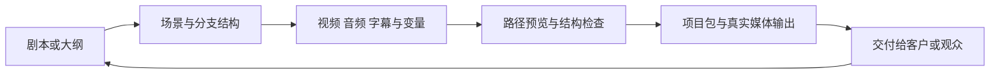

# CinePlayStudio 商业化影游编辑器商业计划

> 文档状态：Draft / PM proposal  
> 更新时间：2026-08-04  
> 适用版本：`0.1.0` 至 `1.0.0`，以及 `1.0.0` 后商业扩展  
> 本文性质：产品与商业决策框架，不替代现有发布卡、工程任务卡或验收证据

## 1. 一句话战略

把影游从“视频素材加几个按钮”升级为一种可编译、可测试、可交付的互动叙事作品：创作者输入剧本和素材，编辑器将其转换为场景图、分支逻辑、多轨时间线和可预览成果，最终输出可保存、可复用、可发布的影游项目。

因此，CinePlayStudio 不应定位为又一个通用视频剪辑器，而应定位为：

> **面向影游和互动叙事团队的 Story-to-Playable 生产工作台。**

核心商业价值不是“多一个时间轴”，而是把原本分散在编剧、剪辑、策划、程序和测试之间的交接，收敛为一份结构化的互动项目，并降低分支内容的制作、验证和返工成本。

## 2. 本次产品决策

### 2.1 选择的核心切口

先服务“需要快速做出可玩的互动样片或完整分支作品”的小型影游制作团队，再向品牌内容、IP 工作室、影视教育和定制项目扩展。

首个可售卖闭环是：

### 2.2 明确不做的事情

- 不与 Premiere、DaVinci Resolve 竞争完整的专业非线性剪辑能力。
- 不把 AI 文本拆解包装成独立护城河。AI 是加速器，结构化项目模型、验证和交付链才是核心资产。
- 不在 `1.0.0` 前承诺云同步、多人实时协作、OSS 直接发布、独立播放器平台或任意 JavaScript 插件执行。
- 不在真实保存、导入、渲染和导出闭环完成前收取“商业发布”费用。
- 不用广告、内容抽成或绑定云端存储作为第一阶段收入来源。

### 2.3 推荐的商业化原则

1. **先卖生产效率，再卖分发能力。** 第一阶段收入来自软件订阅、团队席位和企业服务，而不是观众端抽成。
2. **本地优先，云服务可选。** 本地媒体和本地渲染降低影视素材上传、隐私和基础设施成本；AI、协作、备份和发布服务单独计费。
3. **按工作空间和交付价值收费。** 个人创作者按席位，团队按工作空间，制作公司按项目交付能力和服务等级。
4. **所有商业承诺都必须有真实证据。** Mock、fallback、dev-only 和 packaged/release verified 必须分开记录。

## 3. 当前事实与商业含义

| 当前事实                                                        | 商业含义                               | 尚未确认的风险                                              |
| --------------------------------------------------------------- | -------------------------------------- | ----------------------------------------------------------- |
| 已有场景节点、选项、条件、变量和目标场景模型                    | 具备互动叙事的核心数据骨架             | 条件和动作仍需统一为可验证、可迁移的声明式模型              |
| 已有视频、音频、字幕、触发器、变量、成就、镜头和效果等轨道类型  | 可以形成“剧本到可玩样片”的差异化工作流 | 多轨真实渲染边界仍需按版本冻结                              |
| 已有流程图、时间线、检查器、资产管理器和播放器界面              | 能够承载一体化编辑体验                 | 目前仍需验证首次使用是否足够简单，不能用功能数量代替可用性  |
| 已有 AI 剧本拆解接口和无密钥时的本地 fallback                   | 可以降低首次搭建分支项目的门槛         | AI 输出质量、成本、隐私和自定义 endpoint 安全边界需要产品化 |
| 当前项目管理主要使用浏览器 `localStorage` 自动保存              | 适合原型演示，不足以承载付费项目资产   | 项目目录、恢复、迁移、资产引用和大文件保存必须先完成        |
| 当前仓库已有 Electron、FFmpeg/FFprobe、导出和诊断方向的工程规划 | 产品可以沿桌面发行路线收敛             | 入口存在不等于真实 packaged 能力，必须按现有发布卡逐项验收  |
| 当前发布路线从 `0.1.0` 到 `1.0.0` 已有工程门槛                  | 商业路线可以与工程路线绑定             | M0 尚在控制面收口，不能把本计划当作提前派工授权             |

**PM 判断：** 当前最重要的商业任务不是继续堆能力，而是证明一个目标团队可以用真实素材完成一次完整交付，并愿意为稳定性、节省返工和团队复用付费。

## 4. 目标客户与购买理由

### 4.1 首要 ICP

**2-15 人的互动影游、互动短剧或品牌叙事制作团队。** 常见角色包括编剧/导演、剪辑师、叙事策划、制片人和外包协作者。团队通常有素材和创意，但没有能力或预算长期维护一套完整游戏引擎工具链。

他们购买的不是“编辑器本身”，而是以下结果：

- 剧本改动后，分支结构能快速同步，而不是依赖多份表格和口头说明。
- 导演、编剧和客户能直接预览选择路径，减少“看文档猜成片”的沟通成本。
- 互动条件、变量和结局能在交付前被发现和回归测试。
- 项目可以重开、迁移、备份和交给下一位制作人员，不被某台电脑和某个浏览器绑死。
- 在不招募完整客户端程序团队的情况下，做出可交付的互动样片。

### 4.2 次要客户

| 客户                     | 进入时机   | 付费理由                                         |
| ------------------------ | ---------- | ------------------------------------------------ |
| 品牌内容与广告代理商     | `0.6.0` 后 | 快速制作互动广告、互动 MV 和活动体验，按项目交付 |
| IP、漫画和短剧工作室     | `0.7.0` 后 | 将已有剧情资产转为多结局内容，复用模板和素材     |
| 影视、游戏和数字媒体院校 | `0.7.0` 后 | 教学授权、课程模板、批量管理和本地部署           |
| 大型制作公司或平台       | `1.0.0` 后 | 私有部署、权限、审计、定制导出和长期支持         |

### 4.3 暂不优先的客户

普通视频剪辑用户、希望直接制作完整 3D 游戏的团队、需要 Premiere 级精细剪辑的专业后期团队，以及只想使用 AI 自动生成成片而不维护结构的用户。这些客户会显著扩大产品边界，但不能帮助第一阶段验证核心价值。

## 5. 产品定位与护城河

### 5.1 定位句

对需要制作互动剧情的影游团队，CinePlayStudio 是一个把剧本、媒体、分支逻辑和交付输出放在同一份项目中的桌面生产工具；相比通用剪辑器、表格和定制游戏开发，它让团队能更快看到可玩的结果，并且让分支内容可检查、可迁移、可复用。

### 5.2 四层产品护城河

1. **结构层：互动项目 schema**  
   统一场景、分支、变量、时间线、资产、版本和发布清单，避免每个项目重新发明数据格式。
2. **生产层：从剧本到样片的工作流**  
   AI 拆解、流程图、时间线、检查器、素材绑定和路径预览形成连续操作，而不是孤立功能。
3. **质量层：可验证的互动内容**  
   检查断链、未绑定资产、不可达节点、变量条件、结局覆盖和导出失败，提供制作团队愿意付费的“少返工”。
4. **交付层：项目包、媒体输出和运行时接口**  
   让作品可以保存、备份、交接、迁移、预览和导出。后续再把运行时授权和发布服务作为增值收入。

其中，插件生态、模板市场和云协作都属于第四层的扩展，不应在结构层和质量层尚未稳定时提前建设。

## 6. 版本与商业路线

现有工程发布阶梯继续作为唯一技术主线；商业工作在同一版本上增加“客户证据”和“付费门槛”，不另起一套会与工程事实冲突的版本号。

| 版本         | 工程结果                                    | 商业结果                                      | 商业门槛                                     |
| ------------ | ------------------------------------------- | --------------------------------------------- | -------------------------------------------- |
| `0.1.0`      | 桌面发行底座可验证                          | 内部演示版本，不收费                          | 先完成 M0 控制面收口和提交复核               |
| `0.2.0`      | Web/PC 能力真实、安全、一致                 | 建立可信产品边界                              | 所有按钮和状态都不再返回假成功               |
| `0.3.0`      | 项目可靠保存、恢复和迁移                    | 解决付费项目最核心的资产安全顾虑              | 真实项目重启、损坏和旧版迁移均有确定行为     |
| `0.4.0`      | 本地素材真实导入、预览和重开                | 邀请 3 个设计合作团队使用真实素材             | 移动项目目录后资产仍可用，失败不丢项目       |
| `0.5.0`      | 安装版完成创建、编辑、预览、保存和 ZIP 导出 | 封闭 Beta，验证“能否独立交付”                 | 至少 5 名外部测试者按现有发布卡完成核心旅程  |
| `0.6.0`      | 单视频、字幕、可选音频的真实 MP4            | 启动首批付费试点，按试点合同收取软件/服务费   | 用户自有场景真实导出，失败、取消和恢复可诊断 |
| `0.7.0`      | 发行加固、支持和隐私边界                    | 公开 Beta，开放 Pro 预售或候补名单            | 首次使用者仅依赖产品和公开文档完成核心流程   |
| `0.9.0-rc.1` | 签名、升级、回退和 RC 观察期                | 冻结价格、授权、服务条款和支持等级            | 形成可回退的候选包和真实外部验证记录         |
| `1.0.0`      | 稳定下载、文档和清晰支持范围                | 正式销售 Creator Pro、Team 试用和 Studio 报价 | 已付费用户可以稳定完成一项真实交付           |

### 6.1 商业验证节奏

#### 阶段 A：问题验证，配合 `0.1.0-0.3.0`

- 访谈不少于 10 个目标团队，重点记录当前制作链、返工来源、项目交接方式和可接受预算。
- 招募 3 个设计合作团队，每个团队带来一份真实且获授权的剧本和媒体样本。
- 用现有原型完成“剧本 -> 分支 -> 路径预览”的任务，不把演示完成误写为产品可交付。
- 冻结首个垂直模板：建议为 5-8 个场景、至少 2 个选择、2 个结局、1 个变量和 1 个字幕/音频轨道。

**退出条件：** 至少 6 个被访团队明确认可“减少分支沟通和返工”是付费价值，且至少 3 个团队愿意进入真实素材试用。否则调整切口，不扩功能。

#### 阶段 B：交付验证，配合 `0.4.0-0.6.0`

- 以本地素材和安装版为准完成核心闭环。
- 每个设计合作团队至少完成一次项目重开、一次路径审查和一次真实输出。
- 记录完成时间、阻塞步骤、错误码、是否恢复成功和是否愿意继续使用。
- 在真实渲染达到 `packaged_verified` 后，启动 2 个付费试点，合同优先卖“软件许可 + 交付支持”，不承诺未实现的云服务。

**退出条件：** 有至少 2 个团队愿意为下一项目付费，且付费理由是产品价值而不是单纯的人情或定制开发。

#### 阶段 C：可复制销售，配合 `0.7.0-1.0.0`

- 把首个试点项目沉淀为模板、案例和 10 分钟演示路径。
- 上线产品官网、下载、版本回退、用户文档、问题反馈和许可说明。
- 以公开 Beta 收集合格线索，优先销售 Pro 和 Studio，而不是追求大量免费注册。
- 通过模板包、合作工作室和数字媒体课程建立低成本获客渠道。

**退出条件：** 公开用户可以独立完成核心旅程，团队可以在不依赖作者现场操作的情况下处理安装、恢复、导出和支持问题。

## 7. 收费模型假设

以下为首轮市场验证区间，不是最终价目表。最终价格必须由访谈、试点报价和续费意愿校准。

| 方案                | 目标用户                 | 初始价格假设                        | 包含内容                                                       | 不应提前承诺                       |
| ------------------- | ------------------------ | ----------------------------------- | -------------------------------------------------------------- | ---------------------------------- |
| Free / 体验版       | 学习者、个人试用         | `0`                                 | 基础编辑、模板项目、低配预览或带标识输出                       | 不保证商业发布、无限 AI 或企业支持 |
| Creator Pro         | 独立创作者               | `99-199 元/月` 或 `999-1,999 元/年` | 本地项目、真实媒体导入、MP4 预览、模板、有限 AI 配额和版本更新 | 云同步和实时协作                   |
| Team                | 2-15 人团队              | `699-1,999 元/月/工作空间`          | 多席位、项目交接、评审记录、版本历史和团队支持                 | 在权限与协作未实现前不得销售       |
| Studio / Enterprise | 制作公司、学校、品牌客户 | 年度报价                            | 私有部署、批量授权、定制模板、培训、SLA 和合规支持             | 未经验证的运行时平台和大规模云渲染 |

### 7.1 增值收入顺序

1. 软件订阅和年度许可：第一收入来源。
2. AI 用量包：只对实际发生的云模型调用收费；本地 fallback 不伪装为 AI 服务消耗。
3. 模板与行业资产包：在模板质量和版权流程稳定后上线。
4. 运行时/发布授权：当独立播放器或发布接口真实可用后，按项目或发行规模收费。
5. 实施与培训：面向 Studio/Enterprise，作为高客单价服务，不替代产品化。

**不建议的模式：** 对创作者的观众收入做早期抽成。它需要平台分发、支付、内容审核和数据归因能力，会把产品从“制作工具”拖成“内容平台”，与当前技术和商业边界不一致。

## 8. 产品指标与商业指标

首期指标必须围绕“作品完成并能交付”，不能用页面访问量或 AI 调用次数替代价值。下列数字是试点阶段的初始目标，需在首轮访谈后修订。

### 8.1 北极星指标

**每周完成一次“可预览互动项目交付”的合格团队数。**

在运行时发布能力上线后，逐步替换为“每周完成一次可发布互动作品交付的合格团队数”。

### 8.2 漏斗指标

| 阶段       | 指标                                     | 初始目标                                       |
| ---------- | ---------------------------------------- | ---------------------------------------------- |
| 激活       | 新用户导入剧本或打开模板后形成第一个分支 | 30 分钟内完成，试点完成率不低于 80%            |
| 首次价值   | 看到一次真实路径预览                     | 首次使用当日完成率不低于 70%                   |
| 项目可靠性 | 重启后恢复最近一次成功保存               | 试点项目 100% 可恢复，失败必须有明确恢复路径   |
| 输出       | 真实 MP4 或项目包成功交付                | 支持矩阵内成功率不低于 95%，按失败类别单独统计 |
| 留存       | 30 天内创建第二个项目                    | 设计合作团队不低于 50%                         |
| 商业       | 合格试点转付费                           | 先验证 2 个付费试点，再设公开转化率目标        |
| 支持       | 无作者现场接管完成核心流程               | `0.9.0` RC 前形成独立完成记录                  |

### 8.3 数据原则

- 在用户明确同意前，不上传剧本、媒体、完整路径和 API key。
- 先记录匿名的阶段、耗时、成功/失败、错误码和版本，再考虑更细粒度遥测。
- 每个指标都要标明来源：自动化测试、安装包测试、设计合作、付费试点或用户访谈。
- “技术验证”“商业验证”“用户接受”分开记账；其中一层通过不能替代另外两层。

## 9. 获客与销售路径

### 9.1 第一批客户怎么来

1. **设计合作制：** 从互动短剧、互动广告和独立影游工作室中筛选 3 个团队，以真实项目共创模板。
2. **案例驱动：** 每个案例展示输入剧本、分支图、路径预览、交付包和节省的返工步骤，不只展示 UI 截图。
3. **垂直模板：** 先做 1 个高质量模板，再根据同一模板的复用率决定是否扩展模板市场。
4. **合作渠道：** 与影视后期工作室、独立游戏社群、数字媒体院校和互动内容培训机构合作。
5. **转介绍：** 对设计合作团队提供年度折扣或模板共建权益，换取可公开的匿名案例和同行推荐。

### 9.2 销售话术的中心

不要说“我们有 AI、插件和很多轨道”。应直接展示：

> 你的团队可以把一份剧本变成可点击的分支样片；每次改稿后，节点、条件、素材和路径都在同一份项目里，交付前能发现断链，项目换电脑也能恢复。

### 9.3 试点合同边界

首批付费试点建议包含：固定版本、固定项目范围、有限培训、问题响应时间、数据不外传条款、明确的输出格式和验收条件。不要把“帮客户做完一部作品”包装成软件 ARR，也不要把定制开发需求混入标准产品承诺。

## 10. 商业能力对应的产品待办

### P0：在当前技术路线内必须完成

- 真实项目目录、唯一 schema、版本迁移和可靠保存。
- 本地素材复制、引用校验、重开和项目移动后的路径恢复。
- Web/PC 能力分类、明确错误码、无 mock success。
- 单场景真实 MP4 输出、取消、失败清理和可诊断 Job。
- 项目包导入/导出、用户文档和干净机器上的安装版核心旅程。
- 条件和动作的声明式、可验证表示，继续遵守禁止任意脚本执行的安全边界。

### P1：支撑付费试点

- “项目健康检查”：断链、未绑定资产、不可达节点、无出口节点、未使用变量和结局覆盖。
- “交付检查清单”：支持的媒体格式、字体、分辨率、输出路径和许可提示。
- 模板创建、复制和版本说明。
- 受控的 AI 配额、密钥管理、失败回退和成本记录。
- 诊断摘要、日志入口、问题反馈和恢复向导。

### P2：在有付费拉力后建设

- 团队成员、权限、评审批注和项目版本历史。
- 云端备份和跨设备同步。
- 独立播放器或运行时发布授权。
- 模板/插件市场，但插件优先采用声明式扩展或隔离进程，不恢复任意 JS 执行。
- 批量渲染、云渲染和平台分发。

## 11. 近期迭代顺序

本计划不改变现有控制面：在 `0.1.0` M0 提交和验证收口前，不启动 M1 正式实现。收口后按以下顺序推进：

详细任务卡、依赖关系、回调格式和派工边界见[商业化任务拆解板](./commercialization-task-board.md)。

| 顺序 | 工作                                 | 业务问题                   | 可接受证据                               |
| ---- | ------------------------------------ | -------------------------- | ---------------------------------------- |
| 1    | 完成 M0 关闭与 `0.2.0` 能力真实性    | 产品能否可信安装和运行     | 发布卡中的工程、打包和安全门禁           |
| 2    | 访谈 10 个 ICP，锁定首个模板         | 到底谁愿意付费             | 访谈记录、预算区间、明确试用意愿         |
| 3    | 实现 `0.3.0` 项目可靠性              | 客户敢不敢把真实项目放进来 | 100 次编辑保存、崩溃恢复、迁移 fixture   |
| 4    | 实现 `0.4.0-0.5.0` 本地素材与 PC MVP | 能否独立完成项目交付       | 外部测试者使用自有素材完成核心旅程       |
| 5    | 实现 `0.6.0` 最小真实渲染            | 是否产生客户愿意付费的结果 | 用户自有场景真实 MP4、失败分类和输出检查 |
| 6    | 启动 2 个付费试点                    | 价值是否足够强             | 合同、付款、交付记录和续用意愿           |
| 7    | `0.7.0-1.0.0` 做公开销售准备         | 能否可复制获客和支持       | 文档、下载、签名、回退、支持和 RC 观察期 |

### 11.1 每个迭代的 PM 闸门

每项新增需求都必须回答：

1. 是否直接缩短从剧本到可交付互动作品的时间，或降低分支返工风险？
2. 是否保持当前版本的非目标，尤其是云协作、运行时平台和任意插件执行边界？
3. 是否能在当前仓库和当前发布版本中形成真实、可复核的验收证据？

三问中任意一问为否，就进入候选池，不进入当前迭代。

## 12. 主要风险与应对

| 风险                       | 早期信号                                | 应对                                                       |
| -------------------------- | --------------------------------------- | ---------------------------------------------------------- |
| 客户把产品当成通用剪辑器   | 需求集中在调色、复杂转场和专业混音      | 明确与剪辑器的边界，优先打通导入和交付，不扩成 NLE         |
| AI 拆解结果不稳定          | 用户需要大量手工修正场景和选项          | AI 只生成候选结构，必须经过 schema 校验和可视化审查        |
| 真实媒体和许可带来交付风险 | 试点无法使用客户素材或输出字体缺失      | 建立格式、字体、编码和授权清单，失败必须显式               |
| 本地优先导致协作弱         | 客户需要多人同时修改同一项目            | 先做可交接项目包和版本历史，再决定云协作是否值得建设       |
| 付费集中在定制项目         | 每个客户都要求独有功能                  | 设定标准产品边界，只有能服务三个以上客户的能力进入主线     |
| 过早建设生态               | 模板和插件数量增长但项目完成率不升      | 以项目完成和复用为准，生态建设必须由付费需求触发           |
| “演示成功”被误当作“可售卖” | 仍依赖示例 URL、mock 日志或作者现场操作 | 发布证据分层，任何假成功、数据丢失或不可恢复问题阻断商业化 |

## 13. PM 最终建议

CinePlayStudio 的商业化主线应锁定为：

> **用一份结构化互动项目，替代影游团队分散的剧本表、流程图、剪辑工程和程序交接；先让团队可靠地做出并交付互动样片，再扩展到协作、运行时和发布服务。**

因此，下一阶段只追三个结果：

1. 真实项目不丢、能迁移、能交接。
2. 真实素材能预览、能检查、能输出。
3. 至少两个目标团队愿意为这套生产效率付费。

如果这三个结果没有同时成立，继续增加 AI、插件、特效或平台功能都不能证明商业模式成立。
