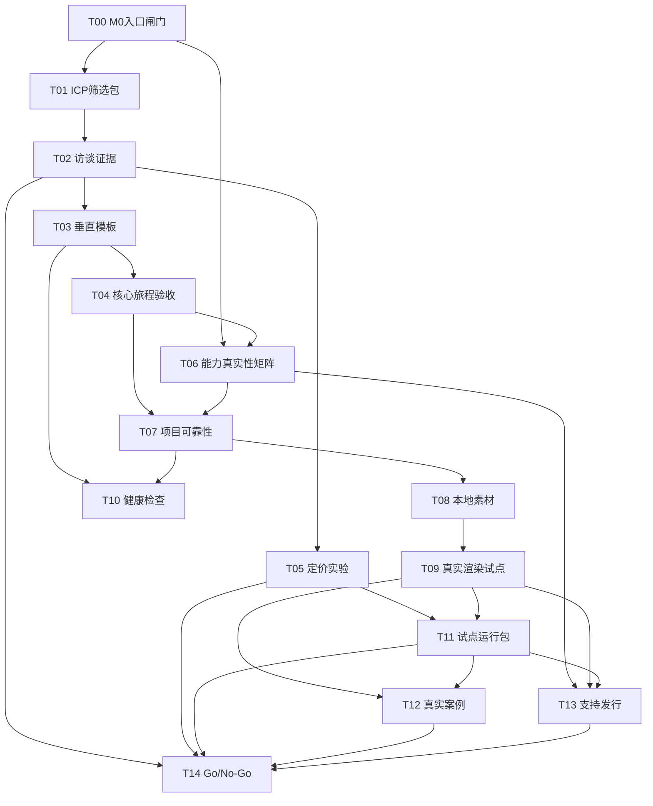

# GameEditor 商业化任务拆解板

> 任务板状态：2026-08-04 已完成一轮 prepare-only 长工派发与回执吸收  
> 更新时间：2026-08-04  
> 上游计划：[商业化影游编辑器商业计划](./commercialization-plan.md)  
> 控制原则：本任务板只完成拆解和派工准备；当前 M0 提交复核未关闭前，不启动 M1 正式实现

本轮状态摘要：`T00 verified`（入口闸门决策）、`T01 verified`（研究包文件验收，未做真实访谈）、`T04 prepared`、`T06 prepared`；`T05 blocked`（审计文件已完成，但有效价格反馈为 `0/5`、正式报价讨论为 `0/2`）。所有任务均未进入 M1 工程实现。

## 1. 大管家结论

商业化不能从“继续加功能”开始，而要从一条可证据化的路径开始：

```text
目标客户确认
  -> 首个标准模板
  -> 核心用户旅程
  -> 项目可靠性
  -> 本地素材与真实输出
  -> 设计合作
  -> 付费试点
  -> 可复制销售
```

本轮将商业计划拆为 **15 项可执行任务**。每项任务都必须有明确角色、输入、产出、依赖和验收，不接受“持续推进”“优化体验”“完善商业化”这类无法关闭的任务描述。

## 2. 任务状态与派工规则

| 状态       | 含义                                           |
| ---------- | ---------------------------------------------- |
| `prepared` | 目标、边界、验收和依赖已明确，可以进入派工评审 |
| `ready`    | 依赖已满足，可以派给对应角色                   |
| `blocked`  | 有明确阻断条件，未解除前不得假装推进           |
| `verified` | 产出物和验收证据已由 PM 复核                   |
| `accepted` | 业务负责人确认结果可进入下一任务               |

### 当前硬边界

- `T00-T05`、`T10-T11` 可以做 PM 准备、访谈和商业材料，不涉及 M1 产品实现。
- `T06-T09` 的工程实现必须等待 M0 提交复核关闭后再派发；当前只能准备验收包、fixture 设计和接口约束。
- `T12-T14` 依赖真实外部验证，不能用示例项目、模拟日志或作者现场操作替代。
- 原始客户剧本、媒体、联系方式和访谈录音不得写入公共仓库；仓库只保留脱敏结论和授权后的引用。

## 3. 任务总览

| ID    | 任务                     | 角色                     | 当前状态   | 前置任务                          | 结果类型      |
| ----- | ------------------------ | ------------------------ | ---------- | --------------------------------- | ------------- |
| `T00` | M0 商业化入口闸门复核    | 大管家 + PM              | `verified` | 无                                | 控制面决策    |
| `T01` | ICP 访谈与筛选包         | 产品经理                 | `verified` | `T00`                             | 研究包        |
| `T02` | ICP 访谈执行与需求证据   | 产品经理                 | `prepared` | `T01`                             | 用户证据      |
| `T03` | 首个垂直模板规格         | 产品经理 + 叙事设计      | `prepared` | `T02`                             | 产品规格      |
| `T04` | 核心用户旅程验收矩阵     | 产品经理 + QA            | `prepared` | `T03`                             | 验收矩阵      |
| `T05` | 定价与包装验证实验       | 产品经理 + 商务          | `blocked`  | `T02`                             | 定价决策包    |
| `T06` | Web/PC 能力真实性矩阵    | 产品经理 + 架构负责人    | `prepared` | `T00`, `T04`                      | M1 准备包     |
| `T07` | 项目可靠性验收包         | 产品经理 + 数据/桌面工程 | `prepared` | `T04`, `T06`                      | M2 任务包     |
| `T08` | 本地素材与资产许可验收包 | 产品经理 + 媒体工程      | `prepared` | `T07`                             | M3 任务包     |
| `T09` | 真实渲染付费试点验收包   | 产品经理 + 媒体工程 + QA | `prepared` | `T08`                             | M5/试点任务包 |
| `T10` | 项目健康检查规则集       | 产品经理 + 叙事设计 + QA | `prepared` | `T03`, `T07`                      | P1 产品规格   |
| `T11` | 设计合作与付费试点运行包 | 产品经理 + 客户成功      | `prepared` | `T02`, `T05`, `T09`               | 试点执行包    |
| `T12` | 首个真实案例与价值证明   | 产品经理 + 市场          | `prepared` | `T09`, `T11`                      | 商业案例      |
| `T13` | 支持、文档与发行准备包   | 产品经理 + 运营 + QA     | `prepared` | `T06`, `T09`, `T11`               | 支持包        |
| `T14` | 付费与公开 Beta Go/No-Go | 大管家 + PM              | `prepared` | `T02`, `T05`, `T11`, `T12`, `T13` | 决策记录      |

## 4. 可执行任务卡

### T00：M0 商业化入口闸门复核

- **目标：** 确认商业任务可以进入准备阶段，但不越过 M0/M1 控制面。
- **负责人：** 大管家；产品经理配合。
- **输入：** `docs/orchestration/index.md`、`current-dispatch-shortlist.md`、`status.json`、商业化计划。
- **动作：** 核对当前 Git 提交、M0 证据、M1 开启条件和未提交文档范围，建立本轮任务板的状态快照。
- **产出：** 一份 `commercialization-entry-gate` 记录，包含 `go`、`prepare-only` 或 `blocked` 结论。
- **验收：** 记录必须说明 M0 是否真正关闭、哪些任务可准备、哪些任务只能等待；不得把“文件存在”写成“功能已验证”。
- **阻断：** M0 提交复核未完成，`T06-T09` 不得进入工程派工。

### T01：ICP 访谈与筛选包

- **目标：** 为首轮用户研究建立可执行的目标客户筛选规则。
- **负责人：** 产品经理。
- **输入：** 商业计划中的 ICP、购买理由、非目标客户和首个闭环。
- **动作：** 制定筛选问卷、访谈提纲、授权说明和脱敏记录模板，至少覆盖工作流、分支返工、项目交接、真实输出和预算。
- **产出：** `ICP screener`、访谈提纲、记录模板、用户同意文本。
- **验收：** 访谈问题必须能区分互动影游团队、品牌内容团队和普通剪辑用户；至少 10 个问题映射到明确商业假设；不得用诱导式问题预设产品价值。
- **阻断：** 不能确认受访者有真实互动内容制作任务，或无法获得记录授权。

### T02：ICP 访谈执行与需求证据

- **目标：** 验证“减少分支沟通和返工”是否是真实付费价值。
- **负责人：** 产品经理。
- **前置：** `T01`。
- **动作：** 完成不少于 10 个合格团队访谈，记录当前工具链、项目规模、交付方式、失败成本、预算和试用意愿。
- **产出：** 脱敏访谈记录、问题编码表、需求频次表、反例清单、设计合作候选名单。
- **验收：** 至少 6 个团队明确认可目标价值，至少 3 个团队愿意带真实且获授权的样本进入试用；若未达到，必须调整切口并暂停功能扩展。
- **阻断：** 只得到“觉得有意思”的口头反馈，没有真实项目、预算或后续行动承诺。

### T03：首个垂直模板规格

- **目标：** 将商业定位落成一个可复用、可展示、可验收的标准影游模板。
- **负责人：** 产品经理 + 叙事设计负责人。
- **前置：** `T02`。
- **动作：** 定义 5-8 个场景、至少 2 个选择、2 个结局、1 个变量、字幕和音频轨道；写出节点命名、条件、资产需求和完成路径。
- **产出：** 模板说明、节点表、分支图、资产清单、变量表、验收样本和版权说明。
- **验收：** 新成员能依据规格复现完整分支；所有节点有入口或出口；所有素材有来源和授权状态；模板不依赖任意 JavaScript 执行。
- **阻断：** 模板只能靠作者口头解释，或无法使用真实授权素材闭环。

### T04：核心用户旅程验收矩阵

- **目标：** 把“从剧本到交付”的价值链转成可观察的验收步骤。
- **负责人：** 产品经理 + QA。
- **前置：** `T03`。
- **动作：** 拆解创建/导入项目、生成场景、绑定分支、绑定素材、路径预览、保存、重开、检查、导出和交接。
- **产出：** 场景化验收矩阵，每一步包含前置条件、操作、预期结果、失败码、恢复动作、证据类型和用户角色。
- **验收：** 每个核心步骤都有成功、失败、取消和恢复判定；明确区分 mock、dev、packaged 和真实用户证据；矩阵可直接转成 E2E 或人工测试脚本。
- **阻断：** 只描述“功能存在”，没有用户完成条件或失败判定。

### T05：定价与包装验证实验

- **目标：** 验证 Creator Pro、Team 和 Studio 三层包装是否符合目标客户的购买逻辑。
- **负责人：** 产品经理 + 商务负责人。
- **前置：** `T02`。
- **动作：** 制作 3 版价格卡和试点报价单，分别测试个人、工作空间和年度授权；记录用户愿意购买的结果，不测试未实现的能力。
- **产出：** 定价假设表、价格访谈脚本、试点报价模板、异议清单和价格调整规则。
- **验收：** 每个价格档位绑定真实交付价值、服务边界和不包含项；至少获得 5 个有效价格反馈，其中至少 2 个团队愿意进入正式报价讨论。
- **阻断：** 客户只愿意为定制开发或人工代做付费，不能证明软件价值。

### T06：Web/PC 能力真实性矩阵

- **目标：** 为 `0.2.0` 建立产品承诺的真实能力边界。
- **负责人：** 产品经理 + 架构负责人。
- **前置：** `T00`、`T04`。
- **动作：** 盘点 Projects、Assets、Media、Exports、AI、Diagnostics 每个入口，标记 Web、PC、unsupported、mock 和 release evidence 状态，定义统一错误码。
- **产出：** capability matrix、错误码表、UI 状态文案表、unsupported 清单和 contract test 清单。
- **验收：** 每个可见按钮都有真实能力归类；失败不返回示例 URL 或模拟成功；Web/PC 合法 fixture 结果一致；任意脚本执行路径明确禁用。
- **派工条件：** 仅在 M0 提交复核关闭后，才能进入产品源码和 IPC 实现。

### T07：项目可靠性验收包

- **目标：** 让付费团队敢把真实项目交给编辑器管理。
- **负责人：** 产品经理 + 数据/桌面工程负责人。
- **前置：** `T04`、`T06`。
- **动作：** 固化 `ProjectDocument` schema、revision、迁移路径、保存队列、恢复文件和旧版/未来版行为；准备中文路径、空格路径、损坏文件和中断保存 fixture。
- **产出：** schema 说明、迁移矩阵、保存/恢复测试计划、固定 fixture、数据丢失应急流程。
- **验收：** 100 次连续编辑后最新 revision 与磁盘一致；强制结束后可恢复最后成功版本或明确提示；旧版按顺序迁移；未来版本只读或拒绝打开，不覆盖原文件。
- **派工条件：** M1/M2 开启，且 schema 和文件边界经过架构负责人确认。

### T08：本地素材与资产许可验收包

- **目标：** 解决真实视频、音频、字体和项目移动带来的交付风险。
- **负责人：** 产品经理 + 媒体/桌面工程负责人。
- **前置：** `T07`。
- **动作：** 定义支持格式、复制/引用策略、路径边界、资产 hash、授权字段、字体策略、seek/range 和大文件行为。
- **产出：** asset contract、支持矩阵、许可清单、1 GB fixture、路径穿越/符号链接测试计划。
- **验收：** 资产导入后可预览、重开和移动项目目录；非法路径、项目外删除和符号链接逃逸被拒绝；1 GB 资产不会让 Renderer 长时间阻塞或整包读入内存。
- **派工条件：** `0.3.0` 可靠性验收通过，M3 资产边界正式开启。

### T09：真实渲染付费试点验收包

- **目标：** 将真实 MP4 输出变成首个可收费的交付结果。
- **负责人：** 产品经理 + 媒体工程 + QA。
- **前置：** `T08`。
- **动作：** 固定单视频、单字幕、可选单音频的输出边界，准备不同字体、中文路径、无音频、损坏输入、磁盘不足和取消 fixture；定义用户验收表。
- **产出：** render job contract、输出检查脚本、支持矩阵、失败分类表、试点验收单。
- **验收：** 安装版真实输出可播放；字幕、音频和时长正确；失败、取消和崩溃不会留下正式目标文件；至少 3 名外部用户在至少 3 台支持机器上完成真实场景输出。
- **派工条件：** `0.6.0` 工程门禁达到 `packaged_verified`，不得用模拟日志替代。

### T10：项目健康检查规则集

- **目标：** 在交付前自动暴露互动项目中最昂贵的错误。
- **负责人：** 产品经理 + 叙事设计 + QA。
- **前置：** `T03`、`T07`。
- **动作：** 定义断链、不可达节点、无出口节点、未绑定资产、未使用变量、条件引用不存在、结局覆盖不足和时序冲突规则。
- **产出：** 规则表、严重级别、修复建议、固定正反 fixture 和 UI 呈现规格。
- **验收：** 每条规则都有可重复 fixture；错误能定位到节点、轨道或变量；用户可以修复后重新检查；健康检查不执行用户脚本。
- **派工条件：** 先完成规格和 fixture；实现排在 `0.5.0` PC MVP 后，不得阻塞 M0。

### T11：设计合作与付费试点运行包

- **目标：** 把外部试用变成可控的产品验证，而不是一次性人工项目。
- **负责人：** 产品经理 + 客户成功负责人。
- **前置：** `T02`、`T05`、`T09`。
- **动作：** 制定合作协议、项目范围、培训时长、数据和素材授权、问题响应时间、验收条件、退款/退出条款和定制需求边界。
- **产出：** 试点合同模板、入场清单、周报模板、问题分级表、退出复盘表和付费转化流程。
- **验收：** 至少 2 个团队签署明确范围的试点；每个试点都有固定版本、真实项目、负责人、截止时间和付款/续用判断；定制开发不被计入标准产品 ARR。
- **阻断：** 客户不愿授权真实结果，或试点只能依赖作者现场接管。

### T12：首个真实案例与价值证明

- **目标：** 将试点结果沉淀为可复制销售资产。
- **负责人：** 产品经理 + 市场负责人。
- **前置：** `T09`、`T11`。
- **动作：** 记录项目原流程、改造后流程、完成时间、返工次数、阻塞问题、输出结果和用户评价；申请公开案例授权。
- **产出：** 脱敏案例、10 分钟演示路径、前后对比数据、FAQ 和销售一页纸。
- **验收：** 每个数字有原始证据引用；案例不泄露剧本、媒体和客户隐私；演示流程可由非作者按文档复现；用户明确确认可公开范围。
- **阻断：** 只有 UI 截图，没有真实项目交付或用户确认。

### T13：支持、文档与发行准备包

- **目标：** 让公开用户无需作者现场操作即可完成核心旅程。
- **负责人：** 产品经理 + 运营 + QA。
- **前置：** `T06`、`T09`、`T11`。
- **动作：** 编写快速开始、项目恢复、资产导入、输出失败、日志提交、known issues、版本回退和卸载说明；建立支持响应等级。
- **产出：** 用户文档、故障排查树、支持模板、隐私/许可说明、发行清单和回退演练记录。
- **验收：** 首次使用者只依赖安装包和公开文档完成核心旅程；支持人员可按错误码定位恢复动作；日志不包含 API key、完整剧本或未脱敏路径。
- **派工条件：** `0.7.0` 前进入，`0.9.0` RC 前关闭关键阻断问题。

### T14：付费与公开 Beta Go/No-Go

- **目标：** 对“继续验证、启动收费、延期或调整切口”做出明确决策。
- **负责人：** 大管家 + 产品经理。
- **前置：** `T02`、`T05`、`T11`、`T12`、`T13`。
- **动作：** 汇总技术证据、用户完成率、试点付款、支持负担、输出成功率和未关闭风险，形成决策选项。
- **产出：** Go/No-Go 记录、价格版本、目标客户口径、未关闭风险 owner、下一周期任务列表。
- **验收：** 只有同时满足“真实交付、外部用户独立完成、至少 2 个团队愿意付费、无数据丢失/假成功/安全阻断”才可建议进入付费公开 Beta；否则必须给出具体调整，不得只写“继续观察”。
- **阻断：** 任一核心证据层缺失，决策状态只能是 `blocked` 或 `pilot_only`。

## 5. 关键路径与并行关系



### 并行执行建议

- **准备并行：** `T01`、`T04` 的方法设计和 `T06` 的能力盘点可以并行准备；但 `T03` 的模板规格要吸收 `T02` 的访谈证据。
- **工程等待：** `T07`、`T08`、`T09` 可以先写验收包和 fixture 设计，但不得在 M0 关闭前派发产品实现。
- **商业并行：** `T05` 可以和 `T02` 同期进行；`T11` 必须等真实输出能力和报价边界确定后执行。
- **关闭顺序：** `T12`、`T13` 完成后，才能进入 `T14` 的付费与公开 Beta 决策。

## 6. PM 回调格式

每项任务完成时，产品经理必须按以下格式回调，避免只报一句“已完成”：

```text
task_id:
status: prepared | ready | blocked | verified | accepted
owner:
scope:
changed_files_or_external_artifacts:
evidence:
acceptance:
failed_cases:
residual_risk:
next_action:
```

### 回调判定

- `prepared` 只表示任务可以派工，不表示已执行。
- `verified` 必须附真实文件、测试、用户记录或外部交付证据。
- `accepted` 需要 PM 或大管家明确接收，并关闭或转移残余风险。
- 任一任务出现 mock、示例 URL、未授权素材、数据丢失或无法复现，状态不得升级。

## 7. 2026-08-04 长工派发回执

| 任务  | 长工会话                                                                            | 状态       | 实际产出                                                                        | 证据与边界                                                                               | 下一动作                                                     |
| ----- | ----------------------------------------------------------------------------------- | ---------- | ------------------------------------------------------------------------------- | ---------------------------------------------------------------------------------------- | ------------------------------------------------------------ |
| `T01` | `019fcbb6-bac4-79f2-b753-26e3551ebe4a`（既有会话）                                  | `verified` | `docs/product/icp-interview-pack.md`                                            | 14 个问题、ICP、授权/隐私、记录模板和证据编码检查通过；没有真实外部访谈                  | 依据研究包执行 `T02`，不得虚构访谈结果                       |
| `T04` | `019fcbf4-10fc-7901-af8a-955ee314e5be`                                              | `prepared` | `docs/product/core-journey-acceptance-matrix.md`                                | 覆盖 11 步骤，区分 mock/dev/packaged/real-user；Prettier 和空白检查通过                  | 等待 `T02/T03`，再转 fixture、E2E 和人工验收脚本             |
| `T05` | `019fcbf4-11aa-73a0-8d4b-3c174717c53f`、替补 `019fcc02-ad85-74d2-a341-e480acba221f` | `blocked`  | `docs/orchestration/sessions/commercialization-t05-pricing-audit-2026-08-04.md` | 设计层审计通过；有效价格反馈 `0/5`、正式报价讨论 `0/2`；没有真实价格访谈、报价或付款证据 | 由 PM/商务执行真实、可追溯的访谈与报价讨论，达到门槛后再复核 |
| `T06` | `019fcbf4-1266-74c2-92e2-97980de75607`                                              | `prepared` | `docs/product/capability-reality-matrix.md`                                     | 基于源码/文档形成六入口矩阵、错误码和 contract test 清单；未标记 `release_verified`      | M0 提交经控制面验证后，再单独评审工程派工边界                |

本轮回执卡：[commercialization-dispatch-round-2026-08-04](../orchestration/sessions/commercialization-dispatch-round-2026-08-04.md)。本轮没有修改产品源码、IPC、配置或版本状态，也没有提交、推送、打包验收或外部用户验收。

## 8. 本轮大管家动作

本轮完成以下动作：

1. 重新读取 M0 控制面、Git 状态和 T00 入口闸门。
2. 并行派发 `T04`、`T05`、`T06`，回收 `T04/T06` 的 prepare-only 产出。
3. 吸收既有 `T01` verified 回执，但保留真实访谈未发生的限制。
4. 记录 `T05` 的平台并发阻塞，并吸收替补长工的设计层审计，不把外部证据缺失写成完成。
5. 不修改产品源码、不改变现有版本状态、不启动 M1 派工。

下一轮派工前，必须再次读取 `docs/orchestration/index.md`、`status.json` 和 Git 状态；只有在依赖和证据满足后，才能把 `prepared` 升级为 `ready`。`T06-T09` 仍不得进入 M1 产品工程实现。
