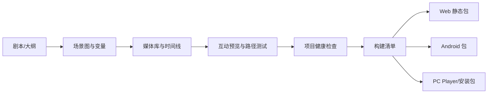
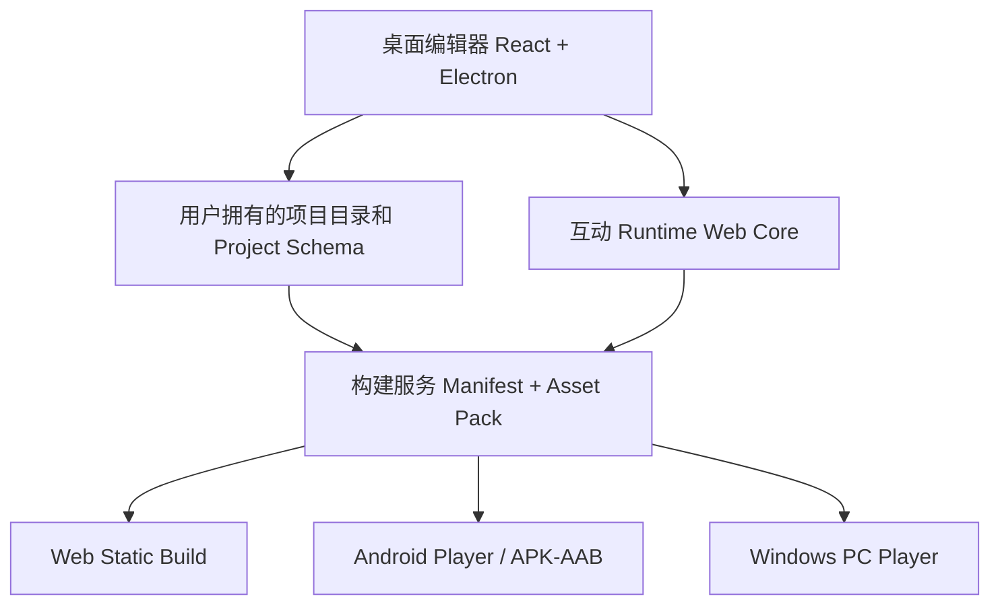

# CineFlow Engine 影游创作引擎商业企划书

> 文档状态：战略提案 / Draft 1
>
> 更新时间：2026-08-06
>
> 适用对象：创始团队、产品、技术、商务、潜在设计合作方
>
> 说明：本文件定义目标市场、产品策略和商业假设，不替代 `docs/orchestration/**` 的当前派工状态、`docs/releases/**` 的版本证据，亦不表示任何规划能力已经实现。

## 1. 执行摘要

### 1.1 一句话定义

**CineFlow Engine 是面向互动影视、影游、互动短剧和品牌叙事的创作引擎：把剧本、视频剪辑、分支逻辑、互动预览与 Web/Android/PC 构建收敛为一个可保存、可测试、可交付的项目。**

它的长期形态类似 Cocos 或 Unity 在互动内容领域扮演的角色，但首发不做通用 2D/3D 游戏引擎，也不复刻剪映或 Premiere 的完整非编能力。它优先解决一个更窄、却直接影响商业交付的问题：

> 一支没有完整客户端研发团队的影游制作团队，能否用自己的视频、图片、音频和剧本，在同一份项目中完成分支内容制作、检查、试玩，并导出可以发给观众的跨端作品。

### 1.2 商业判断

影游制作的痛点不是单个视频片段不能剪，而是以下信息分散且难以验证：剧本在文档、素材在硬盘、分支在表格、交互在程序、验收在多人沟通中。修改一个选项时，团队难以判断哪些镜头、变量、字幕、结局和目标包受影响。

CineFlow 的可售价值是减少这类返工与交接损失，而不是承诺“AI 一键生成一部影游”。生成视频、配音和云渲染成本高、质量不稳定且版权边界复杂，必须是可选工具，不应成为首期单位经济的基础。

### 1.3 首发战略

1. **先做引擎内核，不做内容平台。** 核心资产是项目格式、互动运行时、构建链和质量检查，不是短期素材库或流量分发。
2. **先桌面创作，再统一运行时跨端发布。** 编辑器优先 Windows；作品运行时以 Web 为内核，再封装为 Web 静态包、Android 包和 PC Player。
3. **先剪辑所需的编排能力，再扩展专业后期。** 支持导入、裁切、分段、单主视觉、音频、字幕、选择与转场；不在首发争夺调色、复杂特效或多机位专业剪辑市场。
4. **先本地项目和本地渲染，再考虑云。** 用户自有媒体留在本地；云端仅承载明确授权的 AI、协作、备份或发布增值服务。
5. **先设计合作和付费试点，再开放公开订阅。** 付费前必须证明真实团队能独立完成交付，而不是只展示漂亮 UI。

## 2. 愿景、边界与当前事实

### 2.1 长期愿景

三到五年内，CineFlow 成为互动叙事内容的标准创作与发布环境：创作者能从剧本建立可玩项目，用时间线组织媒体，用图形化逻辑定义选择，用内置检查验证分支，并一次构建 Web、Android 和 PC 作品。

### 2.2 “引擎”在本产品中的含义

这里的“引擎”由四个可独立验证的层组成：

| 层       | 职责                                                  | 首期边界                               |
| -------- | ----------------------------------------------------- | -------------------------------------- |
| 项目层   | 场景、变量、媒体、时间线、版本、配置和构建清单        | 规范化项目文件，用户拥有目录和资产     |
| 创作层   | 剧本拆分、节点图、剪辑时间线、字幕、选择和测试        | 覆盖互动影视制作，不覆盖通用游戏编辑器 |
| 运行时层 | 读取项目、播放媒体、处理选择、变量、存档和 UI 主题    | 一个 Web 核心运行时，跨端复用          |
| 构建层   | 打包资源、校验 manifest、生成 Web/Android/PC 目标产物 | 每个目标有明确支持矩阵和失败诊断       |

这不是从零研发 C++ 图形渲染器的计划。首期应复用成熟的浏览器媒体能力、FFmpeg、Electron、Android WebView/Capacitor 等底座，把投资集中在互动项目模型、编辑体验、运行时一致性和构建可靠性。

### 2.3 首期明确非目标

- 不做 Unity 或 Cocos 的通用 3D、物理、战斗、动画状态机和插件生态替代品。
- 不做剪映、Premiere 或 DaVinci 等级的全专业后期剪辑。
- 不以视频/语音生成 API 调用量作为产品价值或主要收入。
- 不在首发提供观众端内容社区、广告分成、支付、直播或大规模云分发。
- 不执行项目、插件、AI 返回或用户素材中携带的任意脚本。
- 不把 Web、Android、PC 的按钮、mock、示例 URL 或模拟日志当成已交付跨端能力。

### 2.4 当前工程事实

当前仓库已经具备场景节点、时间线、互动播放器、变量、条件、资产管理和 Electron 方向的 UI/工程基础；这些是可复用的原型资产。当前真实状态仍是桌面壳与 P0 准备阶段，真实项目保存、完整本地资产、真实媒体任务及跨端构建均需以独立证据确认。

因此，以下表述在商务材料和产品界面中必须保持：

- 当前是 **内部 Alpha / 规划与受限实现阶段**，不是已可商业交付的跨端引擎。
- 所有产品声明以当前发布卡和验收记录为准；本企划书中的版本、价格和收入仅是待验证假设。
- Mock、fallback、演示素材与真实输出必须分开标记。

## 3. 用户、场景与购买理由

### 3.1 首要客户画像

**2-15 人的互动短剧、影游、IP 叙事和品牌互动内容团队。** 典型成员是编剧/导演、剪辑师、互动策划、制片、外包美术与少量技术人员。他们已有脚本和素材，但不希望为每个项目重复搭建完整游戏客户端。

他们购买的不是“更多轨道”，而是以下结果：

- 剧本改动能定位影响的分支、镜头、字幕和结局。
- 编剧、导演、客户可直接试玩路径，不依赖表格猜测成片。
- 项目可保存、迁移、备份和交接，不被某个浏览器或某台电脑绑定。
- 同一互动作品可按支持矩阵导出 Web、Android 和 PC，而非为三端重复开发。
- 交付前可发现断链、不可达结局、缺失素材和条件错误。

### 3.2 次级客户

| 客户                       | 进入时机         | 场景                      | 购买逻辑                         |
| -------------------------- | ---------------- | ------------------------- | -------------------------------- |
| 品牌内容与广告代理商       | 有稳定交付后     | 互动广告、活动页、互动 MV | 缩短从脚本到客户可试玩样片的周期 |
| 漫画、小说、短剧 IP 工作室 | 有模板与运行时后 | 多结局番外、IP 互动化     | 复用已有素材和剧情资产           |
| 数字媒体院校               | 教学模板稳定后   | 互动叙事实训、作品集      | 降低课程部署与技术辅导成本       |
| 制作公司/平台              | 私有化能力后     | 批量项目、审计、培训      | 需要治理、支持和可控交付         |

### 3.3 非客户与拒绝理由

- 单纯剪短视频的个人用户：通用剪辑器的体验、素材生态和获客效率更强。
- 需要 3D 游戏、战斗、多人在线的团队：应使用成熟通用引擎或与其集成。
- 只想“输入一句话就生成成片”的客户：其核心需求是内容生成或代制作，不是影游引擎。
- 没有合法素材使用权、希望绕过版权或审核的客户：不进入目标市场。

## 4. 产品方案

### 4.1 核心工作流

### 4.2 创作编辑器

**项目与剧情**

- 剧本导入、场景拆分、节点图、条件、变量、成就和多结局管理。
- 图形化选择与声明式动作；禁止以自由 JavaScript 字符串实现逻辑。
- 场景、资产、轨道和构建产物使用稳定 ID，可追踪引用和版本。

**剪映式媒体编排，不做剪映式全量功能**

| 能力级别         | 必须能力                                                               | 非目标                           |
| ---------------- | ---------------------------------------------------------------------- | -------------------------------- |
| L1：首个可售闭环 | 导入、裁切、拆分、排序、单主视频/图片、单音频、字幕、选择触发点、预览  | 调色、关键帧、复杂特效、自动卡点 |
| L2：付费团队效率 | 多视觉轨、BGM/SFX 分轨、基础转场、代理文件、批量字幕、素材替换影响检查 | Premiere 级时间重映射、专业混音  |
| L3：高价值扩展   | 受控滤镜、模板化镜头语言、角色/场景替换、可选 GPU 编码                 | 任意第三方效果插件、自由脚本     |

**互动预览与质量**

- 在编辑器内选择路径、查看变量、重置存档和比较结局。
- 自动检查断链、不可达节点、无出口节点、未绑定资产、变量引用错误、条件冲突和构建阻塞项。
- 每次构建保留版本、支持矩阵、资源 manifest、警告和错误码；不把未知状态解释为成功。

### 4.3 统一运行时与跨端构建

| 目标    | 交付形式                                 | 首期技术策略                                              | 用户价值                     |
| ------- | ---------------------------------------- | --------------------------------------------------------- | ---------------------------- |
| Web     | 静态目录/ZIP，可部署到用户选择的静态托管 | Web Runtime + manifest + 本地资源                         | 链接试玩、嵌入官网、快速交付 |
| Android | APK/AAB 或受控 Android Player 壳         | 同一 Web Runtime 离线封装，原生层负责文件、全屏和媒体策略 | 面向移动观众的安装与分发     |
| PC      | Windows Player/安装包                    | Electron Player 或后续更轻量壳，复用同一 Runtime          | 离线演示、展会、发行合作     |

**关键战略：一个 Runtime，不是三套产品。**

项目构建先产出与平台无关的互动包：`project manifest + runtime config + media assets + save schema`。Web、Android 和 PC 只是不同宿主。只有在同一项目能通过各自 smoke 时，才可宣称跨端支持。

### 4.4 AI 与媒体成本策略

AI 只承担加速器角色：剧本结构化、字幕草案、图片提示词、素材标签和可选配音/视频建议。默认不自动调用付费生成服务。

- 默认优先使用用户自有或已授权资产。
- 任何生成服务必须显式授权、显示预计成本和提供可取消任务。
- 支持 BYOK 或按用量包计费；平台不为不可控视频生成成本兜底。
- 本地图片、字幕、简单镜头运动和预览可在不调用生成 API 的情况下完成。
- 所有 AI 输出必须标记来源，不因“生成成功”自动获得商业素材许可。

## 5. 差异化与竞争策略

| 方案                      | 强项                             | 对目标用户的缺口                                     | CineFlow 的策略                                  |
| ------------------------- | -------------------------------- | ---------------------------------------------------- | ------------------------------------------------ |
| Unity/Cocos               | 通用游戏能力、成熟生态、跨端发布 | 对视频主导叙事的时间线、分支内容和影视工作流不够直接 | 不替代其通用引擎；提供更快的影游创作与可选互操作 |
| 剪映/Premiere/DaVinci     | 强剪辑、素材处理、后期生态       | 没有互动变量、路径测试、结局覆盖和游戏构建           | 只覆盖影游所需剪辑，优势放在互动项目与交付       |
| Twine/Ren'Py/视觉小说工具 | 低门槛分支叙事                   | 视频媒体、时间线与影视交付较弱                       | 用媒体时间线和跨端播放器承接真人影像叙事         |
| 视频生成/AI Agent 工具    | 快速生成局部素材                 | 成本、风格一致性、版权和可控性不足                   | 做受控接入与资产治理，不靠生成量竞争             |
| 定制开发外包              | 可按单项目深度适配               | 复用差、周期长、持续维护贵                           | 把可复用的项目格式、模板、检查和运行时产品化     |

真正的护城河不是“一个时间线组件”，而是：

1. **互动影视项目标准**：场景、媒体、变量、选择、存档和构建清单的稳定 schema。
2. **可复用 Runtime**：一次实现互动规则，三个宿主一致播放。
3. **质量与交付系统**：把“交付前发现返工”变成产品能力。
4. **垂直模板与案例**：沉淀可被团队复用的影游生产方法，而不是只卖空工具。

## 6. 商业模式与定价假设

### 6.1 收入模型优先级

1. 桌面编辑器订阅和年度许可证。
2. 团队工作空间、构建支持和项目交接服务。
3. 受控 AI 用量包、模板包与培训服务。
4. 私有化部署、定制模板和企业支持。
5. 在 Runtime、发布流程与治理成熟后，才评估模板市场和发行授权。

不以观众收入抽成、广告、素材版权转售或强制云渲染作为早期收入来源。

### 6.2 初始包装假设

| 方案       | 建议价格假设                     | 面向对象               | 包含                                         | 不包含                     |
| ---------- | -------------------------------- | ---------------------- | -------------------------------------------- | -------------------------- |
| Free       | 0 元                             | 学习者与评估用户       | 模板项目、基础预览、带标识构建或受限导出     | 商业交付、团队支持、云服务 |
| Creator    | 99-199 元/月，或 999-1,999 元/年 | 独立创作者             | 本地项目、支持矩阵内的构建、模板、版本更新   | 无限 AI、协作、企业 SLA    |
| Studio     | 999-2,999 元/月/工作空间         | 2-15 人制作团队        | 多席位、项目交接、优先支持、构建/诊断额度    | 未实现的云协作、无限云渲染 |
| Enterprise | 8-30 万元/年起                   | 学校、制作公司、品牌方 | 私有部署、批量授权、培训、支持窗口、定制模板 | 不经评估的定制开发承诺     |

这些不是正式报价。每一档必须通过至少 5 个有效价格反馈、2 个正式报价讨论和真实试点付款后才可固化。

### 6.3 单位经济原则

- 本地编辑、本地预览和本地渲染的边际成本应接近零，避免收入随媒体时长线性恶化。
- AI、云存储、云转码和分发必须按成本可见、可封顶、可单独计费的模型进入。
- 试点服务费和定制开发应独立核算，不能被包装成可复制订阅收入。
- 只有在毛利、支持负担和续用证据成立后，才扩张付费用户数。

## 7. 获客、销售与试点

### 7.1 首批客户获取

1. 访谈 10-15 个互动短剧、影游、品牌互动团队，筛选正在进行真实项目者。
2. 选择 3 个设计合作团队，每个团队带入一份已获授权的剧本和少量媒体样本。
3. 用一套 5-8 场景、2 个选择、2-3 个结局的标准模板完成第一次闭环。
4. 把结果沉淀为脱敏案例：原有流程、返工点、完成时长、出错点和交付结果。
5. 通过影视后期工作室、互动内容社群、数字媒体院校和 IP 服务商做垂直合作，而不是广泛投放。

### 7.2 销售话术

> 不是让你换掉剪映或 Unity，而是让你的剧本、素材、选择和交付包第一次存在于同一份可验证项目里。改一条分支后，你能知道影响什么，也能直接构建给客户或观众试玩。

### 7.3 付费试点设计

- 固定版本、固定项目范围、固定支持时长和固定构建目标。
- 仅承诺支持矩阵内的媒体格式、目标平台与功能；不为未实现能力承诺交付日期。
- 客户必须确认素材权利、测试授权和诊断数据最小收集范围。
- 试点验收以独立完成的真实项目旅程为准，不以作者现场代操作为准。
- 试点退出时，客户仍应能导出项目与资产，不被平台锁定。

## 8. 产品与技术路线

### 8.1 推荐技术架构

**架构原则**

- Renderer 不拥有 Node 权限；文件、构建、FFmpeg、签名与敏感配置通过受控主进程/服务执行。
- 项目使用版本化 schema、相对路径、原子保存、恢复文件和稳定错误码。
- 构建使用 manifest、哈希和资源许可信息，目标失败必须可诊断与可清理。
- 互动逻辑是受限的声明式 schema，不执行任意脚本。
- 视频处理使用可取消 Job；首发以软件编码和受控格式为基线，再评估硬件加速。

### 8.2 阶段化能力

| 阶段                      | 用户结果                               | 关键能力                                         | 商业判断               |
| ------------------------- | -------------------------------------- | ------------------------------------------------ | ---------------------- |
| A：可信桌面创作底座       | 真实项目能创建、保存、恢复、导入和预览 | 项目目录、资产管理、声明式逻辑、错误码           | 未收费，验证可用性     |
| B：影游剪辑与 Web Runtime | 团队能编辑并构建一个 Web 可玩样片      | L1 时间线、字幕、选择、Web 静态包、项目检查      | 设计合作、收集价值证据 |
| C：PC/Android Player      | 同一项目在三种目标按支持矩阵运行       | 统一 manifest、移动/桌面宿主、存档兼容、构建诊断 | 首批付费试点           |
| D：团队效率与模板         | 团队能复用项目、协作交接、压缩返工     | 模板、版本历史、评审批注、代理媒体、批量构建     | Studio 订阅验证        |
| E：企业能力               | 有治理要求的客户可控部署               | 私有化、权限、审计、培训、集成                   | Enterprise 销售        |

### 8.3 Web、Android、PC 的实际发布顺序

1. **Windows 编辑器**：先完成真实项目和本地素材闭环，这是所有后续目标的前提。
2. **Web Runtime 与静态构建**：第一条面向观众的交付路径，成本最低、验证最快。
3. **PC Player**：针对展会、离线演示、发行合作的受控播放器，不等同于编辑器安装包。
4. **Android Alpha**：在 Web Runtime、媒体兼容和存档迁移稳定后，用同一包封装；先支持固定机型矩阵，再扩设备覆盖。

不得反过来先做 Android/PC 打包按钮，再补项目格式、媒体兼容、构建清单和错误诊断。

## 9. 经营计划、成本与资金需求

### 9.1 人员配置

| 阶段     | 最小角色                                     | 主要责任                                     |
| -------- | -------------------------------------------- | -------------------------------------------- |
| 验证期   | 产品/创始人、桌面前端工程、媒体/Runtime 工程 | 客户访谈、项目内核、L1 时间线、首个 Web 样片 |
| 试点期   | 增加 QA/构建工程、叙事设计/客户成功          | 跨端 smoke、样本项目、试点交付、问题闭环     |
| 商业化期 | 增加销售/合作、支持、Android 工程能力        | Studio 销售、培训、设备矩阵、支持体系        |

### 9.2 投入区间（经营假设，不是融资承诺）

| 目标               | 团队与周期假设       | 预计投入区间   | 成功标准                                         |
| ------------------ | -------------------- | -------------- | ------------------------------------------------ |
| 精益问题验证       | 3 人核心团队，6 个月 | 80-150 万元    | 10+ 访谈、3 个设计合作、1 个真实 Web 样片        |
| 可收费桌面/Web MVP | 5-7 人，12-18 个月   | 300-550 万元   | 真实保存/资产/构建、2 个付费试点、可复现支持流程 |
| 三端产品化         | 7-10 人，18-24 个月  | 600-1,000 万元 | Web/Android/PC 支持矩阵、续费证据、团队产品收入  |

完整“影游版 Unity + 剪映 + 分发平台”若同时自建，需要远高于以上投入，且会显著提高失败概率。因此资金使用优先级必须是项目内核和 Web Runtime，其次才是 Android/PC 封装、云能力和生态。

### 9.3 收入验证节奏

| 时间窗口   | 必须验证的商业事实                            | 失败时的动作                  |
| ---------- | --------------------------------------------- | ----------------------------- |
| 前 3 个月  | 目标客户的返工问题与真实项目存在              | 调整 ICP 或停掉非核心功能     |
| 3-6 个月   | 设计合作团队愿意带授权样本试用                | 重做模板与入门流程，不扩端    |
| 6-12 个月  | 至少 2 个团队愿意为下一项目付费               | 保持 pilot_only，避免公开订阅 |
| 12-18 个月 | 用户能不依赖作者完成一次交付，且有续用/转介绍 | 扩展 Studio 销售与目标平台    |

早期收入以试点许可、培训和支持为主是正常的；但应将服务收入与产品订阅收入分账，防止把人工代做误判为产品市场需求。

## 10. 成功指标与 Go/No-Go 门槛

### 10.1 北极星指标

**每周完成一次可试玩、可重开、可交付的互动项目构建的合格团队数。**

该指标必须同时满足：项目保存成功、素材引用有效、至少两条路径可玩、目标包可运行、失败有错误码。单独的 AI 调用次数、安装量、页面访问或 UI 操作次数不能替代它。

### 10.2 阶段指标

| 维度       | 验证期目标              | 试点期目标                  | 公开 Beta 前目标     |
| ---------- | ----------------------- | --------------------------- | -------------------- |
| 激活       | 30 分钟内建立第一个分支 | 80% 设计合作用户完成        | 80% 外部用户独立完成 |
| 项目可靠性 | 真实项目可重开          | 异常恢复有明确结果          | 无未关闭数据丢失缺陷 |
| 交付       | Web 样片运行            | 支持矩阵内构建成功率 >= 90% | >= 95%，失败可分类   |
| 商业       | 3 个合作意向            | 2 个付费试点                | 续费/复购证据成立    |
| 支持       | 作者可协助              | 支持文档可解决常见问题      | 不依赖作者现场接管   |

### 10.3 付费公开 Beta 的硬门槛

只有同时满足以下条件，才建议进入公开收费：

- 真实项目保存、导入、预览、构建和重开均有安装版/目标环境证据。
- 至少 5 名外部用户按文档独立完成支持矩阵内的核心旅程。
- 至少 2 个团队的付款或下一项目续用决定基于产品价值，而非纯定制或人情。
- 无未关闭的数据丢失、路径越界、任意脚本执行、假成功或严重版权治理问题。
- 目标平台、价格、支持边界和已知问题对外一致。

## 11. 风险与治理

| 风险             | 影响                                       | 预防与止损                                        |
| ---------------- | ------------------------------------------ | ------------------------------------------------- |
| 范围膨胀         | 把引擎、剪辑器、生成平台和分发平台同时开发 | 以统一 Runtime 和 L1 剪辑闭环为首期边界           |
| 媒体生成成本失控 | 毛利被视频/语音重试吞噬                    | 默认不生成，BYOK/预算上限/逐次授权                |
| 跨端媒体兼容     | Android、PC、Web 行为不一致                | manifest、固定支持矩阵、每端 smoke 和真实设备验证 |
| 用户数据损失     | 直接失去付费团队信任                       | 原子保存、恢复、版本迁移、项目目录归用户所有      |
| 版权与内容风险   | 作品无法发行或产生争议                     | 资产来源、许可证、AI 来源和构建清单可追溯         |
| 竞争误判         | 与成熟通用剪辑/游戏引擎正面竞争            | 锁定互动影视工作流与交付质量，不追功能表          |
| 服务化陷阱       | 定制项目吞没产品研发                       | 固定试点范围，服务与订阅分账，拒绝未产品化承诺    |

## 12. 未来 90 天行动计划

### 第 1-30 天：确认问题与首个标准项目

- 完成 10-15 个合格 ICP 访谈，记录返工、交接、构建和预算证据。
- 选择一个单一垂直模板，例如 5-8 场景互动短剧或品牌互动样片。
- 冻结项目 schema、声明式条件/动作和支持素材格式的最小边界。
- 将所有 mock/fallback 入口在产品与商务话术中明确标记，停止假成功演示。

### 第 31-60 天：完成可信创作闭环

- 完成真实项目目录、保存/恢复、资产导入与路径安全的受限实现和测试。
- 用真实授权素材跑通“剧本 -> 节点 -> 时间线 -> 预览 -> 项目包”。
- 制定 Web Runtime 的 manifest、存档与构建失败契约。
- 邀请 3 个设计合作团队带入真实小样本。

### 第 61-90 天：验证构建与付费意愿

- 发布受控 Web 可玩样片，记录构建、加载、选择、存档与错误分类。
- 完成试点报价测试，区分软件许可、培训、支持和定制开发。
- 对每个设计合作项目复盘完成时间、返工数、阻塞点和继续使用意愿。
- 只在 Web 闭环和客户证据成立后，审批 PC Player 或 Android Alpha 投入。

## 13. 需要管理层确认的决策

1. 品牌是否使用 `CineFlow Engine`，或保留 `GameEditor` 作为研发代号。
2. 首个垂直内容类型：互动短剧、真人影游、品牌互动广告或 IP 番外。
3. 首期是否坚持“Windows 编辑器 + Web Runtime”，并把 Android/PC Player 设为后续门槛功能。
4. 是否接受“生成媒体默认可选且独立计费”，而不是把 AI 生成承诺为基础功能。
5. 试点是否允许包含有限培训和支持，但严格排除无边界定制开发。
6. 在客户证据不足时，是否同意暂停跨端扩张而非继续堆功能。

## 14. 结论

CineFlow 有机会成为影游制作的专用引擎，但前提不是把现有原型尽快堆成“Unity + 剪映 + AI 视频平台”。正确的路径是先证明一件更具体的事：目标团队是否愿意为一条可靠的互动影视生产与构建链付费。

首发产品应以 **桌面创作 + 统一 Web Runtime + 受控剪辑 + 项目可靠性** 为核心。Web、Android 和 PC 的跨端能力属于同一运行时的阶段性构建目标；AI 生成、云协作、市场和分发平台只在单位经济与用户需求被证实后扩展。这样既保留“影游版 Cocos/Unity”的愿景，也让每一笔投入有可验证的商业与工程退出条件。
