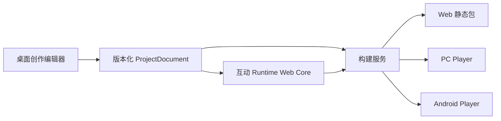
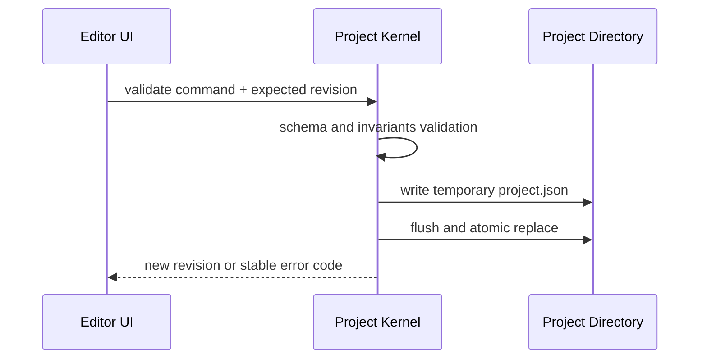

# CineFlow Engine 技术架构

> 状态：Architecture Proposal / Draft 1
>
> 上游：[影游创作引擎商业企划书](../product/interactive-cinematic-engine-business-plan.md)
>
> 事实边界：本文件描述目标架构，不表示其中的项目、媒体、Runtime 或跨端构建能力已经实现或发布。

## 1. 目标

CineFlow Engine 的技术目标是把互动影视作品表示为一个可保存、可验证、可在多个宿主运行的项目，而不是在每个平台各自实现一套内容逻辑。



首期的核心技术决策是：**同一个 ProjectDocument 和 Runtime 驱动 Web、PC、Android；平台差异收敛到 Build Adapter 与 Host Adapter。**

## 2. 架构原则

1. 项目目录和媒体资产归用户所有；应用只维护受控引用、缓存与恢复信息。
2. 编辑器、运行时和构建器通过版本化 schema 通信，不通过 UI 状态或任意脚本字符串通信。
3. Renderer 被视为不可信进程；文件、进程、构建、签名和密钥只在受控边界执行。
4. 互动逻辑采用声明式条件和动作；禁止 `eval`、`new Function`、动态 import 或项目内脚本执行。
5. 每个异步任务都要有可观察状态、取消语义、稳定错误码与临时文件清理规则。
6. `mock`、`fallback`、`dev_verified`、`packaged_verified` 与 `release_verified` 不能混用。

## 3. 分层与所有权

| 层             | 负责                                 | 输入                      | 输出                              | 禁止承担                         |
| -------------- | ------------------------------------ | ------------------------- | --------------------------------- | -------------------------------- |
| Editor         | 场景、轨道、变量、素材引用、预览控制 | ProjectDocument、用户操作 | 修改命令、预览状态                | 文件直写、FFmpeg、密钥、平台签名 |
| Project Kernel | schema、版本、保存、恢复、资源索引   | 命令、选择目录、文件流    | revision、错误码、ProjectDocument | 业务 UI、任意脚本执行            |
| Media Pipeline | probe、代理、渲染、缩略图、媒体 Job  | 资产 ID、受控参数         | JobEvent、产物路径、诊断          | Renderer 内同步阻塞、伪造结果    |
| Runtime        | 播放、选择、变量、存档、主题         | build manifest、用户输入  | 可玩状态、受限存档                | 编辑器 API、主机文件系统权限     |
| Build Adapter  | 打包 Runtime、资源、manifest、目标壳 | 已验证项目 revision       | Web/PC/Android 产物               | 修改原项目、执行项目脚本         |
| Host Adapter   | 平台权限、全屏、文件、媒体策略、诊断 | Runtime 受限请求          | Host capability result            | 注入任意原生能力                 |

## 4. 项目目录与数据边界

建议项目目录：

```text
<user-selected>/<project-name>.cineflow/
  project.json
  assets/
    originals/
    proxies/
  thumbnails/
  builds/
  exports/
  .cache/
  .recovery/
```

`project.json` 必须仅保存规范化相对路径、稳定 ID、版本与声明式结构。绝对路径、API key、平台凭据、调试日志和临时 FFmpeg 参数不能进入项目文档。

### 4.1 最小领域模型

| 实体           | 必填责任                                                    |
| -------------- | ----------------------------------------------------------- |
| Project        | schemaVersion、id、name、revision、settings、创建/修改时间  |
| Scene          | id、名称、时长、节点关系、媒体轨引用、入口/出口语义         |
| Asset          | id、类型、相对路径、内容 hash、大小、时长、来源/许可状态    |
| Timeline       | 场景内有序轨道、clip、时间范围、静音/锁定状态               |
| Interaction    | 选项、条件、声明式动作、目标场景、可见性与错误定位          |
| Build Manifest | 输入 revision、Runtime 版本、目标、资源清单、hash、构建选项 |
| Save State     | Runtime 版本、项目/构建 ID、变量快照、当前场景、恢复点      |

### 4.2 修改与保存流程



失败时保留最后一次成功 revision；不能返回“已保存”并覆盖用户数据。

## 5. 互动逻辑模型

条件和动作必须是白名单操作，而不是 JavaScript：

```ts
type Condition =
  | { op: "equals"; variableId: string; value: string | number | boolean }
  | {
      op: "compare";
      variableId: string;
      comparator: ">" | ">=" | "<" | "<=";
      value: number;
    }
  | { op: "all"; children: Condition[] }
  | { op: "any"; children: Condition[] };

type Action =
  | { op: "setVariable"; variableId: string; value: string | number | boolean }
  | { op: "addVariable"; variableId: string; value: number }
  | { op: "gotoScene"; sceneId: string }
  | { op: "unlockAchievement"; achievementId: string };
```

Runtime 和编辑器使用同一 evaluator。每个条件、动作和失败都应能定位到项目中的场景、选项或变量 ID。

## 6. 安全与隐私

- 文件选择、资产复制、构建输出和日志导出必须在 Main/Host 层重新校验路径。
- 只接受当前项目已授权的资产 ID；不接受 Renderer 拼接出的任意路径或 shell 参数。
- 禁止项目、插件、AI 输出、导入文件和构建包触发任意命令或脚本。
- 日志需要 correlationId，并默认脱敏 API key、授权头、完整剧本和用户绝对路径。
- AI 服务必须独立于项目文件保存凭据，采用显式授权、调用预算和可追踪 provenance。

## 7. 关键架构决策

| 决策         | 选择                        | 理由                                                         |
| ------------ | --------------------------- | ------------------------------------------------------------ |
| 编辑器宿主   | Windows Electron 优先       | 复用现有 React/Electron 资产，便于本地文件与 FFmpeg Job 管理 |
| Runtime 内核 | Web Runtime                 | 一份互动逻辑服务 Web、PC、Android，减少三端分叉              |
| 跨端顺序     | Web -> PC Player -> Android | Web 验证成本最低；PC/Android 只在 Runtime 稳定后扩展         |
| 项目模型     | 用户目录 + 版本化 schema    | 允许迁移、备份、交接和可测试验证                             |
| 媒体策略     | 本地优先，云可选            | 避免上传、生成和云转码成本成为首期毛利负担                   |
| 插件策略     | 静态描述/受控扩展           | 保持项目可审计，不恢复任意代码执行                           |

## 8. 架构验收

在任何“引擎可用”声明前，至少需要如下证据：

1. 同一项目 revision 能被编辑器、Runtime 和 Build Manifest 一致读取。
2. 项目移动目录、重开、异常保存和旧版迁移有确定结果，不静默丢失数据。
3. Runtime 在受限 fixture 中对同一选择序列得到相同变量与场景结果。
4. Build Adapter 只从已验证 revision 构建，失败/取消不污染原项目或正式目标文件。
5. 每个宣称支持的平台都有对应目标环境 smoke，而不是仅有桌面 UI 或模拟日志。

## 9. 不在本架构范围内

- 通用 3D 渲染、物理、网络同步和游戏玩法系统。
- 任意第三方插件执行、游戏脚本市场或运行时热更新。
- 未经授权的媒体生成、素材抓取、版权规避或观众端内容分发平台。
