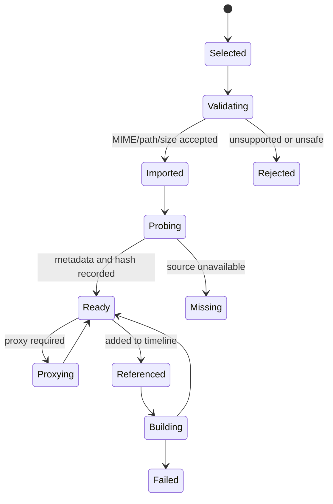

# CineFlow Engine 媒体编排与渲染管线

> 状态：Technical Proposal / Draft 1
>
> 依赖：[技术架构](interactive-cinematic-engine-architecture.md)
>
> 范围：影游制作所需的媒体编排与可控渲染，不承诺专业非线性剪辑器。

## 1. 目标与首期边界

首期目标是让影游团队能够把已授权的视频、图片、音频与字幕编排为可互动场景，并用确定的支持矩阵预览和构建。

| 首期支持                                   | 明确不支持                            |
| ------------------------------------------ | ------------------------------------- |
| 本地导入、metadata probe、缩略图、代理文件 | 实时多机位、专业调色、节点式特效合成  |
| 单主视觉轨、单 BGM、单 SFX、单字幕轨       | 任意轨道数量、复杂混音、自动卡点      |
| 裁切、拆分、移动、长度调整、基础淡入淡出   | Premiere/DaVinci 级关键帧和时间重映射 |
| 互动触发点、选择暂停、场景转场             | 代码插件、自由 shader、任意效果包     |
| 本地预览、受控 FFmpeg Job                  | 云渲染、GPU 加速承诺、批量队列        |

## 2. 媒体资产生命周期



### 2.1 资产导入规则

- 用户通过原生文件选择器授权输入文件，Main 层验证文件、路径、类型、大小和项目根包含关系。
- 资产复制到项目目录，保存相对路径、hash、原始名称、类型、时长、尺寸和许可证字段。
- 文件名、显示名称、缩略图和探测结果不能代替真实文件字节。
- 中文、空格、长路径、损坏文件、重复文件、符号链接与项目外路径均必须在 fixture 中覆盖。
- 代理文件与缩略图属于可重建缓存；删除缓存不能破坏 originals 和项目文档。

## 3. L1 时间线数据与交互

### 3.1 轨道约束

| 轨道   | L1 上限 | 责任                       |
| ------ | ------- | -------------------------- |
| 主视觉 | 1       | 视频或图片片段构成场景画面 |
| BGM    | 1       | 场景背景音，可选循环       |
| SFX    | 1       | 受控短音效片段             |
| 字幕   | 1       | 文本、样式预设、时间范围   |
| 互动   | 1       | 选择、条件、变量变化、跳转 |

后续多轨能力必须在单轨导入、保存、预览、构建、取消和错误恢复已经稳定后开启。

### 3.2 编辑命令

编辑器只产生可验证命令：

- `addClip(trackId, assetId, start, duration)`
- `moveClip(clipId, start)`
- `trimClip(clipId, sourceIn, duration)`
- `removeClip(clipId)`
- `setSubtitle(clipId, text, stylePreset)`
- `setInteraction(triggerId, choices, conditions, actions)`

命令执行前验证时间范围、轨道类型、资产类型、项目 revision 和资源可用性。失败时返回稳定错误码，不由 UI 解析异常字符串判断。

## 4. 预览与渲染 Job

### 4.1 Job 状态

```text
queued -> validating -> running -> succeeded
                         |-> failed
                         |-> cancelling -> cancelled
```

Job 需要输入 revision、目标格式、受控输出位置、correlationId、阶段进度、错误码和临时文件清理记录。`cancelled` 与 `failed` 均不得留下伪装为正式成品的目标文件。

### 4.2 本地渲染基线

- 仅由 Main/Media Service 启动 FFmpeg，参数使用数组且 `shell: false`。
- 初期使用可重复的软件 H.264/AAC 基线；硬件编码只作为显式探测结果，不能作为默认性能承诺。
- 字幕字体使用随包分发或受控字体策略，记录字体许可与可用性。
- 输出先写临时文件，探测成功后原子移动到正式位置。
- Web Runtime 的互动播放与 MP4 线性预览是不同产物；MP4 不保留互动选择。

## 5. 性能预算与支持矩阵

| 项目       | 首期基线                           | 证据                         |
| ---------- | ---------------------------------- | ---------------------------- |
| 资产导入   | 1 GB 输入不整包读入 Renderer       | 进程/内存采样与 fixture      |
| 时间线编辑 | 500 节点、2,000 clips 可操作       | 性能基线与 E2E               |
| 预览       | 编辑器保持响应，长任务不阻塞 UI    | Main/Renderer 事件与人工验证 |
| 输出       | 固定 fixture 可重复播放            | ffprobe/系统播放器检查       |
| 失败处理   | 取消、磁盘不足、损坏输入无正式残留 | Job fixture 和目录检查       |

支持格式、最大文件大小、分辨率、编码器和目标设备必须以版本化矩阵维护。未列入矩阵的输入只能返回明确的 `UNSUPPORTED_MEDIA` 或 `NEEDS_TRANSCODE`。

## 6. 成本控制

- 不将视频生成、配音生成或云转码作为默认路径。
- 预览优先代理文件和本地媒体；云服务只在用户显式启用并看到预算后调用。
- 每个付费媒体 Job 都需单次授权、成本上限、可取消与任务收据。
- 限制首期输出为单场景、单主视觉、单字幕和可选音频，先验证交付而不是扩充特效。

## 7. 验收与失败判定

### 7.1 通过条件

1. 真实本地视频、图片、音频和文档在项目目录中可重开并保持引用。
2. L1 时间线可以裁切、移动、保存、重开与预览；所有修改可定位 revision。
3. 受控渲染 Job 在支持 fixture 上生成可播放产物，字幕、音频和时长正确。
4. 取消、损坏输入、路径非法、磁盘不足和二进制缺失产生稳定错误码与恢复提示。

### 7.2 失败判定

- 只记录文件名/大小，实际将用户媒体替换为远程示例 URL。
- FFprobe/FFmpeg 失败后返回模拟 metadata、模拟日志或 `success: true`。
- Renderer 直接运行 FFmpeg、持有进程句柄或拼接 shell 参数。
- 失败/取消任务在正式目标路径留下残缺文件。
