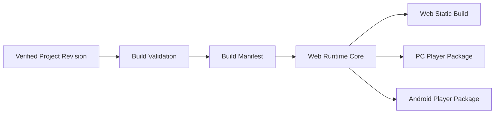

# CineFlow Engine Runtime 与跨端构建契约

> 状态：Technical Proposal / Draft 1
>
> 依赖：[技术架构](interactive-cinematic-engine-architecture.md)、[媒体管线](interactive-cinematic-media-pipeline.md)
>
> 目标：定义一份互动包在 Web、PC Player、Android Player 上一致运行的最小契约。

## 1. 核心原则

构建的输入是一个已验证的项目 revision，输出是一个带版本、资源 hash 与 Runtime 兼容范围的互动包。平台不能读取编辑器内存状态，也不能重新解释时间线或互动逻辑。



## 2. Build Manifest

建议最小结构：

```json
{
  "manifestVersion": 1,
  "buildId": "build-20260806-001",
  "projectId": "project-demo",
  "inputRevision": "rev-42",
  "runtime": { "name": "cineflow-runtime", "version": "0.1.0" },
  "target": "web",
  "entrySceneId": "scene-intro",
  "assets": [
    {
      "id": "asset-video-01",
      "path": "assets/originals/intro.mp4",
      "sha256": "...",
      "mediaType": "video",
      "licenseStatus": "user-confirmed"
    }
  ],
  "compatibility": { "minRuntimeVersion": "0.1.0" },
  "createdAt": "2026-08-06T00:00:00.000Z"
}
```

Manifest 不包含绝对路径、项目密钥、用户隐私字段、未脱敏日志或任意可执行代码。

## 3. Runtime 行为

### 3.1 启动

1. 验证 manifest 版本、目标、Runtime 兼容范围和资源清单。
2. 加载入口场景、默认变量与初始存档。
3. 对缺失/损坏/不兼容资源显示稳定错误页或恢复入口，不伪造播放成功。

### 3.2 互动状态

```ts
interface RuntimeState {
  buildId: string;
  sceneId: string;
  playheadSeconds: number;
  variables: Record<string, string | number | boolean>;
  visitedSceneIds: string[];
  saveVersion: number;
}
```

所有选择由同一声明式 evaluator 处理。给定同一个 Build Manifest、初始状态和选择序列，Web、PC、Android 必须得到相同的场景与变量状态。

### 3.3 存档

- 存档绑定 `buildId`、`projectId`、Runtime 版本和兼容性策略。
- Runtime 只保存最小状态，不复制媒体和完整项目。
- 新构建与旧存档不兼容时必须给出迁移、只读或重新开始选项，不能静默覆盖。

## 4. 目标平台 Adapter

| 目标           | Adapter 职责                                     | 首期验证                                      | 非承诺                             |
| -------------- | ------------------------------------------------ | --------------------------------------------- | ---------------------------------- |
| Web            | 静态文件加载、浏览器存档、全屏与错误页           | Chrome/Edge 支持矩阵和静态托管 smoke          | 所有浏览器、任意 CDN 或平台分发    |
| PC Player      | 本地资源协议、窗口、文件存档、日志、崩溃诊断     | Windows 支持版本上的安装/启动/播放/存档 smoke | 编辑器功能、任意文件访问、自动更新 |
| Android Player | 离线资源、全屏、返回键、音频焦点、存档、诊断导出 | 固定 Android 版本与设备矩阵                   | 全机型、高帧率/GPU 编码、后台下载  |

Runtime 只能请求经过 Host Adapter 允许的能力，例如 `save.read`、`save.write`、`diagnostics.export`。不得暴露通用 Node、Java、Kotlin 或系统命令接口。

## 5. 构建 Job 契约

```text
queued -> validating -> packing -> verifying -> succeeded
                                 |-> failed
                                 |-> cancelling -> cancelled
```

每个 Job 至少记录：

- `buildId`、`inputRevision`、`target`、`runtimeVersion`、`correlationId`。
- 资源枚举、hash 结果、许可证状态、输出路径和临时目录。
- 阶段进度、失败错误码、取消原因和清理结果。

构建只有在 `verifying` 阶段确认 manifest、文件 hash 与目标 smoke 成功后才可标记 `succeeded`。

## 6. 跨端一致性测试

| 用例         | Web  | PC   | Android | 预期                   |
| ------------ | ---- | ---- | ------- | ---------------------- |
| 新开局       | 必测 | 必测 | 必测    | 入口场景和默认变量一致 |
| 同一选择序列 | 必测 | 必测 | 必测    | 场景、变量和结局一致   |
| 条件锁定选项 | 必测 | 必测 | 必测    | 可见性与拒绝原因一致   |
| 存档恢复     | 必测 | 必测 | 必测    | 支持范围内恢复一致     |
| 缺失资源     | 必测 | 必测 | 必测    | 明确错误，不假成功     |
| 旧版本存档   | 必测 | 必测 | 后置    | 按迁移策略处理         |

## 7. 发布门禁

一个目标平台可对外列入支持矩阵，至少需要：

1. 目标环境的固定构建产物与 SHA256。
2. 当前 Runtime/manifest 版本与输入 project revision。
3. 新开局、双路径、存档恢复、缺失资源和卸载/清理的目标平台证据。
4. 已知限制、设备/浏览器范围和恢复入口。
5. 独立验证者的结果，不只由构建者自行声明。

未满足时只能标为 `planned`、`dev_verified` 或 `unsupported`，不得以编辑器 UI、代码目录或单一开发机截图宣称已支持。
